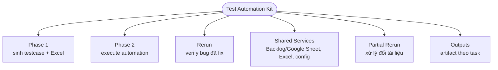
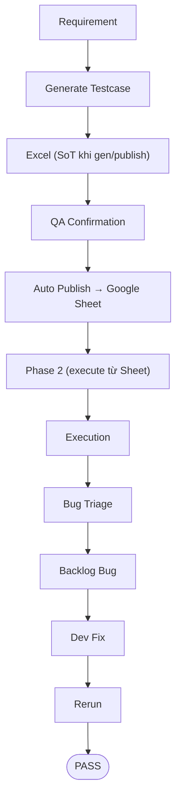
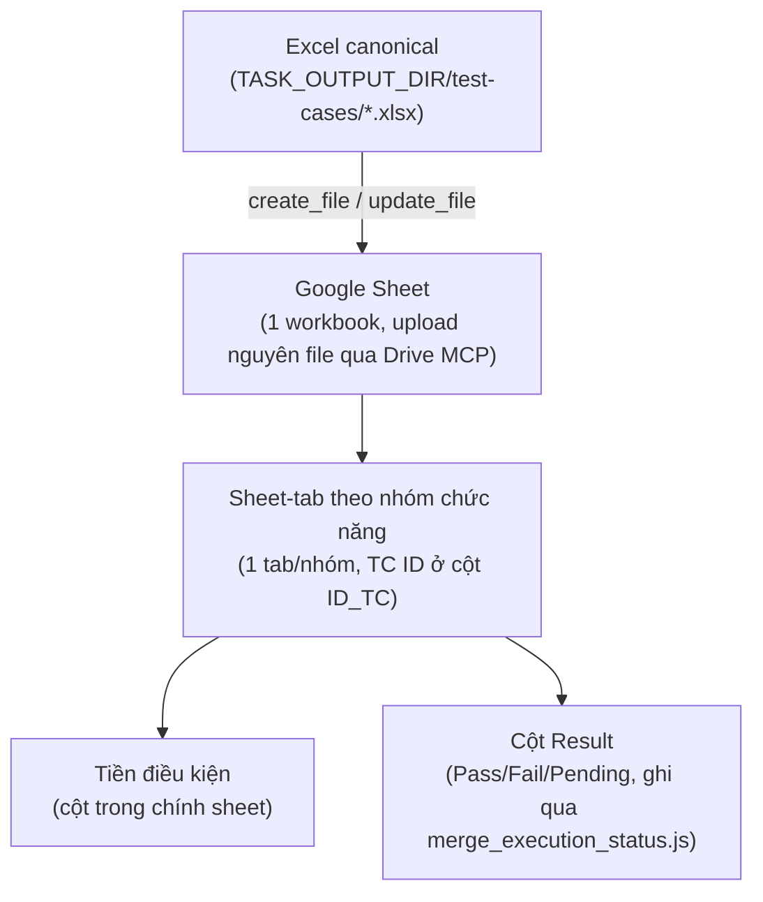

# Test Automation Kit

> Bộ kit dùng để phân tích requirement, sinh testcase, execute automation, triage bug và quản lý evidence theo chuẩn QA automation.

## Overview

Test Automation Kit hỗ trợ quy trình kiểm thử end-to-end cho nhiều project: thu thập requirement, sinh testcase chi tiết, export Excel (source of truth khi gen/publish), publish testcase lên Google Sheet qua Drive MCP, chạy Playwright/API từ testcase canonical local (Phase 2 luôn tải bản Sheet mới nhất), tổng hợp report, triage lỗi và log Backlog bug khi đủ điều kiện.

Tài liệu này là landing page của toàn bộ kit. Team QA nên đọc cùng [USER_GUIDE.md](USER_GUIDE.md) và [QUICKSTART.md](QUICKSTART.md) trước khi chạy Phase 1 hoặc Phase 2.

## Architecture



| Layer | Purpose |
|---|---|
| Phase 1 | Đọc requirement/design/API và sinh testcase Markdown + Excel + coverage report + `### Setup Readiness` (mỗi cell `Tiền điều kiện` mang tag `[<method>]`); Excel là source of truth **khi gen/publish** và là input cho step publish sau QA confirmation (Phase 2 execute luôn tải bản Google Sheet mới nhất). |
| Testcase Publish (Google Sheet) | Step riêng trong phạm vi Phase 1: sau khi QA xác nhận Excel, agent publish qua Google Drive MCP (`search_files` → `create_file`/`update_file`) — file `.xlsx` chính là nội dung Sheet, không ánh xạ field riêng. Nhóm chức năng thành **sheet riêng** trong workbook, TC ID ở cột `ID_TC`, tiền điều kiện trong cột `Tiền điều kiện`. Review nội dung local trước khi ghi đè Sheet thật. |
| Testcase Re-publish | Khi Excel thay đổi sau publish (kể cả từ nhánh phụ `partial-rerun`): re-publish là ghi đè lại toàn workbook — không cần lifecycle/Deprecate riêng như trước, case bị bỏ khỏi Excel tự động biến mất khỏi Sheet ở lần ghi đè kế tiếp. |
| Phase 2 | Đọc testcase từ nguồn canonical local (agent luôn tải bản Google Sheet mới nhất qua Drive MCP trước mỗi lượt execute; `excel` local là opt-out khi chưa publish), chạy Precondition Resolution Pass qua UI/API public-business, execute Playwright, thu evidence ảnh/video, đồng bộ kết quả vào cột `Result` của Sheet (`merge_execution_status.js`). |
| Setup Layer | `tests/support/setup/`: factory/hook/fixture/mock/cleanup/contract dùng chung để dựng tiền điều kiện theo contract; không dựng state bằng DB — chỉ read-only verify UAT qua guarded client `db/uatDbClient.ts` (read-only, chỉ SELECT). |
| Rerun | Chạy lại case fail hoặc bug Backlog đã fix; không dùng để đồng bộ tài liệu nguồn mới. |
| Shared Services | Testcase publisher (Google Sheet), Backlog bug reporter, Google Doc/Sheet reader, Excel converter, runtime config và helper dùng chung. |
| Partial Rerun | Nhánh phụ độc lập để xử lý thay đổi tài liệu nguồn và execute subset bị ảnh hưởng; không được gọi từ Main Flow. |
| Outputs | Lưu requirement artifacts, testcase, execution results, evidence và reports theo từng task. |

## Quick Start

| Step | Action | Command/File |
|---:|---|---|
| 1 | Cài dependencies | `npm install` |
| 2 | Tạo env local từ template | `.env.example` -> `.env.local` hoặc `.env` |
| 3 | Chạy theo prompt Phase 1/Phase 2 | `prompt_templates/run_phase1_template.md`, `prompt_templates/run_phase2_template.md` |

## Workflow Overview



## Folder Structure

```text
test-automation-kit/
├── .claude/
│   └── commands/     # slash command = ĐIỂM VÀO chuẩn hoá (9 lệnh — xem Main Components)
│                     #   CHỈ commands/ được commit; settings*.json là cấu hình máy cá nhân
├── .agent/
│   ├── config/       # verdict_taxonomy · risk_model · branch_parity · ci_scope · case_types
│   │                 #   db.conventions.json  — quy ước DB + bản đồ cột↔nhãn khoá THEO MÀN
│   │                 #   locators.schema.json — schema cho knowledge/locators/*.json
│   ├── workflows/
│   │   ├── phase1_generate_tc.md            # entry Phase 1
│   │   ├── phase1_00_scope_planning.md      # optional: RBT scope + risk register
│   │   ├── phase1_01_prepare_context.md     # gồm Ambiguity Gate (chặn sinh TC khi mơ hồ)
│   │   ├── phase1_02_generate_testcases.md
│   │   ├── phase1_03_validate_export_report.md
│   │   ├── phase1_04_auto_publish_backlog.md
│   │   ├── phase2_execute.md                # entry Phase 2
│   │   ├── phase2_01_prepare_execution.md
│   │   ├── phase2_02_generate_or_update_automation.md
│   │   ├── phase2_03_execute_and_auto_heal.md
│   │   ├── phase2_04_report_and_backlog_gate.md
│   │   ├── rerun.md                         # entry Re-run
│   │   ├── rerun_01_map_bug_to_testcase.md
│   │   ├── rerun_02_rerun_and_verify.md
│   │   └── rerun_03_update_backlog_and_report.md
│   ├── skills/       # 22 skill theo vai trò; phase2/ui_debug_agent = khám phá DOM tìm locator bền
│   └── rules/
├── prompt_templates/
│   ├── run_phase1_template.md
│   ├── run_phase2_template.md
│   ├── run_phase_re-run_template.md
│   ├── phase1/   # 01 setup → 02 gen testcase → 02b output format → 03 gen test data → 04 publish Sheet
│   │   └── dimensions/   # 20 chương CHIỀU coverage (§3–§23) — mở đúng chiều task cần, không nạp cả 20
│   │                     #   §22 inbound callback · §23 DB persistence (bản ghi sau CRUD)
│   └── phase2/   # 04 execute FE → 05 execute API → 06 triage → 07 flaky → 08 log bug Backlog
├── partial-rerun/
│   ├── run_requirement_prepare_review.md
│   ├── run_requirement_apply_approved.md
│   ├── run_testcase_cleanup.md
│   └── reference.md
├── scripts/
│   ├── convert_excel/
│   ├── integrations/   # backlog/ (bug + fetch tài liệu nguồn/Figma) · google_doc/ · google_sheet/ (legacy)
│   └── qa/   # công cụ QA chạy thật: dashboard, accessibility, perf, security, load, risk_score/gate, ui_conformance
├── tests/
│   ├── fe/infra/        # 48 spec KIỂM CHÍNH KIT (gate tự kiểm) — chạy offline, vào CI
│   ├── support/setup/   # setup layer dùng chung (factory/hook/fixture/mock/cleanup/contract)
│   ├── support/setup/db/  # DB Verification Layer (§23) — đọc bản ghi để KHOANH TẦNG lỗi UI vs BE
│   │                      #   read-only tuyệt đối; so sánh theo NGHĨA (money/instant/text)
│   ├── mobile-web/       # spec mobile-web (Playwright device emulation)
│   └── load/             # k6 load script (Loại B, opt-in)
├── knowledge/            # bộ nhớ học: bugs/domain/system/decisions/locators/historical_execution — learning loop
│                         #   ⚠ KHÔNG commit (dữ liệu công ty, như .env). Repo chỉ giữ SCHEMA.md + .gitkeep;
│                         #   nạp lại: npm run learn:bugs:apply (Backlog) · npm run learn -- --scan · ghi tay domain/system
├── exploratory/          # nhánh phụ never-auto (charter-based), ngoài Main Flow
├── profiles/
│   └── <TASK_KEY>/task.env   # env động theo task, nạp qua TASK_ENV (tạo bằng npm run profile:create)
│                         #   ⚠ KHÔNG commit CẢ THƯ MỤC (creds + output chạy thật có PII); chỉ task.env.example
├── outputs/
│   └── <YOUR_PROJECT>/tasks/<TASK_KEY>/
├── README.md
├── QUICKSTART.md
└── RULE_GLOBAL.md
```

## Main Components

| Component | Purpose |
|---|---|
| [USER_GUIDE.md](USER_GUIDE.md) | Hướng dẫn sử dụng Test Automation Kit cho Team QA. |
| [.agent/config/kit-layers.md](.agent/config/kit-layers.md) | **Ranh giới GENERIC (kit dùng chung) vs PROJECT (nội dung dự án)** — tra trước khi sửa: task generic chỉ chạm lớp GENERIC; giao kit cho dự án mới thì bỏ lớp PROJECT. |
| [CHANGELOG.md](CHANGELOG.md) | Lịch sử thay đổi **kit dùng chung** theo ngày + chủ đề (vấn đề → cách chữa), kèm commit hash. Đọc trước khi nâng cấp kit hoặc khi thấy hành vi lạ sau khi pull. |
| [QUICKSTART.md](QUICKSTART.md) | Onboarding nhanh cho project mới. |
| [RULE_GLOBAL.md](RULE_GLOBAL.md) | Quy tắc chung về ngôn ngữ, bảo mật, output và cleanup. |
| `.agent/workflows/` | Workflow chính dạng flat: mỗi flow gồm 1 file entry (`phase1_generate_tc.md`, `phase2_execute.md`, `rerun.md`) và các step file `*_NN_*.md` cùng thư mục. Step đánh số reset theo từng flow (phase1_01..04, phase2_01..04, rerun_01..03). |
| `.claude/commands/` | **Slash command — điểm vào chuẩn hoá** cho 9 luồng: `/preflight` `/phase1` `/phase2` `/rerun` `/partial-rerun` `/explore` `/ui-debug` `/gates` `/publish`. Mỗi command là **con trỏ mỏng**: chỉ nói đọc workflow nào · chạy npm script nào · dừng ở gate nào — **không** chép policy (kit đã có `gate:policy` giữ `RULE_GLOBAL.md` là canonical). Máy giữ chúng khỏi mục rữa: `tests/fe/infra/slash-commands.spec.ts` kiểm mọi npm script/đường dẫn được nhắc phải tồn tại, và mọi nhánh trong `branch_parity.json` phải có command cùng tên. |
| `.agent/skills/` | Skill instructions cho agent theo vai trò chuyên biệt (**22 skill**). Danh mục: `.agent/skills/INDEX.md` (sinh lại: `npm run skills:index`). |
| `.agent/rules/` | Rule bắt buộc cho core behavior, locator, Playwright FE/API. |
| `prompt_templates/` | Prompt dùng để chạy Phase 1, Phase 2 và rerun. Lưu ý đánh số: prompt con là sub-prompt theo hoạt động, số chạy liên tục theo trình tự pipeline (`phase1/01..04` chuẩn bị→sinh testcase→test data→publish Sheet; `phase2/04..08` execute FE→execute API→triage review→flaky→log bug Backlog) — KHÁC với workflow `.agent/workflows/` đánh số reset theo từng phase (phase2_01..04). Số prompt không ánh xạ 1:1 với số workflow; chạy từng prompt khi cần đúng hoạt động đó. **`phase1/dimensions/`** giữ 20 chương **chiều coverage** (§3–§23; tách khỏi `02_gen_testcases.md` ngày 14/08/2026) — mở đúng chiều task khai `required`, không nạp cả 20; **`phase1/02b_output_format.md`** giữ Summary Report + Export Excel, chỉ nạp ở cuối lượt. |
| `partial-rerun/` | Nhánh phụ độc lập; không là dependency của Main Flow và có thể xóa mà Main Flow vẫn chạy. |
| `partial-rerun/run_requirement_prepare_review.md` | Phase 1 của nhánh phụ: tạo diff/impact/testcase draft và dừng chờ Human Review. |
| `partial-rerun/run_requirement_apply_approved.md` | Phase 2 của nhánh phụ: merge testcase đã approve và partial execute. |
| `partial-rerun/run_testcase_cleanup.md` | Chỉ còn cần khi muốn unlink Test↔Story/Task trên Backlog cho case rời Excel sau partial rerun (optional) — re-publish (ghi đè Sheet) đã tự đủ đồng bộ, không còn lifecycle Deprecate riêng. |
| `partial-rerun/reference.md` | Rule tham chiếu duy nhất cho nhánh phụ, thay cho nhiều file workflow/prompt/skill rời rạc. |
| `scripts/convert_excel/` | Convert testcase Markdown sang Excel (đồng thời là nội dung publish lên Google Sheet). |
| `scripts/integrations/backlog/` | Kiểm tra Backlog connection, log bug, fetch tài liệu nguồn/Figma. |
| `scripts/integrations/google_doc/` | Đọc nội dung Google Doc làm nguồn spec. |
| `scripts/integrations/google_sheet/` | LEGACY — scaffolding đọc/ghi Sheet qua service account, chưa wire vào luồng chính (luồng chính giờ dùng Drive MCP, xem `.agent/skills/shared/backlog_testcase_publisher/SKILL.md`). |
| `scripts/qa/` | Công cụ QA chạy thật (tái dùng login/catalog): `dashboard_generate` (dự án trước DS), `accessibility_check` (axe-core), `perf_check` (Loại A), `security_check` (GET, non-prod), `load_check` (k6 wrapper, Loại B), `risk_score`/`risk_gate` (RBT), `ui_conformance_check`. **Forcing functions (round-3):** `preflight_gate` (miss-file), `output_gate` (execute/gen/bug), `design_gate` (thiết kế TC), `locator_lint` (kỷ luật định vị element — chống bắt sai UI → log sai bug), `self_review` (checklist gộp), `hooks/` (SessionStart inject + PostToolUse gate) — non-negotiables ở `CLAUDE.md`, verdict/rerun ở `.agent/config/verdict_taxonomy.json`. Xem `scripts/qa/README.md`. |
| `.github/workflows/` + `.gitlab-ci.yml` | CI/CD: `static-check` mỗi push/MR (node --check + validate JSON + dry-run an toàn, **không secret**); `integration-check`/`task-execute`/regression chạy **manual/nightly** (cần secret, hit UAT). Không auto-publish (human gate). Chi tiết trigger/secrets/an toàn: [.github/workflows/README.md](.github/workflows/README.md). GitHub và GitLab là 2 bản tương đương — dùng một, xoá bản kia. |
| `scripts/ci/` | `set-gitlab-variables.sh`: khai CI Variables lên GitLab từ `.env.local` qua `glab` (mặc định dry-run, `--apply` để set thật; secret set masked+protected, không in giá trị). |
| `knowledge/domain/` | **Business rule đã XÁC NHẬN** — nền của mọi oracle (chống oracle tautological mà rule kit cấm). Versioned, bắt buộc có `source` + `examples {input,expected}` cụ thể, `covered_by` trace tới TC nên BA đổi rule là biết ngay TC nào phải cập nhật. Ghi bằng skill `domain_recorder` (điểm bắt: câu trả lời sau Ambiguity Gate), kiểm bằng `npm run domain:check`. |
| `knowledge/system/` | **Bản đồ hệ thống đã XÁC NHẬN** — `state_machine` (chuyển state nào hợp pháp) · `permission_matrix` (role × action) · `shared_surface` (API/component dùng chung ≥2 module). Khác `domain/` ở chỗ nó **sinh ra nghĩa vụ test**: cặp state không khai = phải có case chứng minh bị chặn, ô ngoài `allow` = phải 403 → trả lời được "hệ thống cho phép X, bug hay đúng thiết kế?" bằng **trích dẫn** thay vì suy từ app. Ghi bằng skill `system_mapper`, kiểm bằng `npm run system:check`; `--impact "<surface>"` cho biết sửa surface dùng chung thì phải regression module nào. |
| `knowledge/decisions/` | **LÝ DO của quyết định đã chốt** — `false_positive` · `by_design` · `risk_override` · `blocked_pass` · `wont_fix` · `test_approach`. Không có nó thì task sau **log lại đúng bug đã bị Rejected**, FAIL đỏ oan case đã chốt là vướng env, hoặc mò lại cách test đã thử thất bại. Bắt buộc tra trước khi log bug: `node scripts/qa/decisions.js --check "<triệu chứng>"`. `rationale` thiếu = CHẶN; `false_positive` phải do Dev/BA/QA-Lead/PO chốt. Ghi bằng skill `decision_recorder`, kiểm bằng `npm run decisions:check` (nêu tên bug `Rejected` chưa có lý do + quyết định quá `expires_at`). |
| `knowledge/setup_recipes/` | **LÀM SAO dựng được state** — steps đúng thứ tự + `pitfalls` (thứ chỉ biết sau khi vấp) + `verification`. Đo thật: 59% tri thức tích luỹ thuộc loại này, trước đây không có chỗ chứa. `method` KHÔNG có `db`. |
| `knowledge/environment/` | **Quirk hạ tầng/env** (token TTL, login throttle, headless trắng…) — không phải bug sản phẩm nhưng không biết thì test fail khó hiểu và dễ kết luận nhầm. |
| `knowledge/` | Bộ nhớ học (learning loop): bug/root cause/locator heal/snapshot pass-fail đã qua gate → nguồn cho RBT + dashboard. **Thu TỰ ĐỘNG**: reporter `learn_reporter` chạy sau mỗi `playwright test` → `learn_task.js` (KPI + snapshot theo module); bug nạp bằng `learn_bugs.js` (lấy từ Backlog theo marker `[found-by-kit]`). `knowledge/examples/` là dữ liệu mẫu; `knowledge/` live khởi tạo rỗng. |
| `scripts/utils/ui/ensure_expanded.js` | Mở panel/accordion ổn định trên DOM "nhiều icon giống nhau": thử ứng viên + nghiệm thu bằng sentinel, tự Escape khi click nhầm modal/dropdown, idempotent. Thay cho click toạ độ chevron (nguồn flaky kinh điển). Regression: `tests/fe/infra/ensure-expanded.spec.ts`. |
| `tests/fe/support/auth/tokenBroker.ts` | Token Broker: giữ 1 phiên SPA đã login sống → lấy token **tươi** mỗi lần gọi API, 401/403 tự refresh + retry ⇒ execute không đứt vì access token hết hạn giữa lượt chạy, `task.env` chỉ cần user/password. Áp cho mọi SPA gửi `Authorization: Bearer`. |
| `exploratory/` | Nhánh phụ độc lập (never-auto, charter-based) — dò rủi ro ngoài testcase đã review; draft phải qua `tc_validator` mới tính coverage. |
| `tests/support/setup/db/` | **DB Verification Layer (§23)** — đọc bản ghi dưới DB sau khi UI đổi dữ liệu để **khoanh tầng** lỗi: UI đúng + DB sai = bug BE persist; UI sai + DB đúng = bug FE render. **Read-only tuyệt đối** với 4 lớp chặn (đọc quyền từ catalog · session read-only · lint câu lệnh · allowlist host), và `preflight_gate` chặn **ở cửa vào** khi task khai dùng §23 mà thiếu config/creds hoặc user không read-only. So sánh theo **NGHĨA** (`money`/`instant`/`text`) và có trạng thái thứ ba `inconclusive` — "không đo được" KHÔNG thành PASS. Bản đồ cột↔nhãn khoá **theo màn** (`.agent/config/db.conventions.json`): cùng một cột có nhãn khác nhau giữa hai màn, và **cùng một nhãn có thể là hai cột khác nhau**. |
| `tests/support/setup/` | Setup layer dùng chung: factory/hook/fixture/mock/cleanup/contract cho Precondition Resolution Pass (xem `tests/support/setup/README.md`). |
| `profiles/` | Env động theo từng task (`profiles/<TASK_KEY>/task.env`, nạp qua `TASK_ENV`); giá trị tĩnh vẫn ở `.env` chung. Tạo bằng `npm run profile:create -- <TASK_KEY>`. |
| `outputs/` | Artifact theo project/task, không hardcode theo một project cụ thể. |

## Execution Flow

| Phase | Input | Output | Gate |
|---|---|---|---|
| Phase 1 | Backlog, tài liệu nguồn, Figma, Swagger, file local | Testcase Markdown + Excel source of truth (khi gen/publish) + coverage summary + `### Setup Readiness` (mỗi cell `Tiền điều kiện` mang tag `[<method>]`) | Cột `Loại case` ∈ 9 type canonical; `Ưu tiên` ∈ Critical…Lowest; mọi precondition có tag cách dựng. |
| Testcase Publish (Google Sheet) | Excel source of truth + QA confirmation | Sheet trên Drive (link lưu `GOOGLE_SHEET_URL`) + publish summary | Step riêng trong Phase 1; agent review nội dung `.xlsx` local trước khi ghi đè Sheet thật qua Drive MCP. |
| Testcase Re-publish | Excel source of truth sau partial rerun + Human Review/QA confirmation | Sheet ghi đè lại toàn workbook, khớp đúng Excel hiện tại | Không cần lifecycle riêng — case rời Excel tự biến mất khỏi Sheet ở lần ghi đè kế tiếp; chỉ cần Human Review trước khi re-publish. |
| Phase 2 | Testcase canonical local (agent luôn tải bản Google Sheet mới nhất qua Drive MCP; Excel local là opt-out khi chưa publish) + tag `[<method>]` của từng precondition + env/app/API URLs/credentials | Playwright results, evidence, execution summary, cột `Result` trên Sheet | Sheet luôn tải MỚI trước mỗi lượt execute (không còn khái niệm mirror cũ/staleness); non-destructive UAT; evidence cho mọi case đã execute. |
| Bug Triage | Failed testcase, logs, screenshot/video | Bug candidate hoặc non-product issue | Không log Backlog nếu fail do setup/prompt/test data. |
| Backlog Logging | Confirmed product/API bug | Backlog sub-bug + ảnh/video evidence | Có expected, actual, reproduce steps và evidence rõ. |
| Rerun | Bug/case fail đã fix hoặc cần verify | Rerun report, Backlog Done nếu PASS thật | Có evidence PASS ảnh/video nếu chuyển Backlog sang Done. |

## Mô hình Traceability (Google Sheet)

Team chạy **toàn bộ testcase của 1 task cùng lúc**. Testcase management giờ là Google Sheet qua Drive MCP — mô hình **phẳng**, không Test Set/Test Plan/Precondition issue/folder/Cycle/Run như công cụ cũ (chi tiết + lịch sử ở [USER_GUIDE §5.5.0](USER_GUIDE.md)):



- **Excel là canonical, Sheet chỉ là bản đồng bộ hiển thị** — mọi sửa nội dung case làm ở Excel rồi re-publish (ghi đè); sửa thẳng trên Sheet sẽ mất ở lần ghi đè kế tiếp.
- **Không folder/tag/Cycle/Run/custom field** như công cụ cũ — nhóm chức năng thể hiện bằng **sheet-tab riêng** trong cùng workbook, dựng từ `md_to_xlsx.js`.
- **Kết quả execute** ghi vào cột `Result` của đúng dòng (khớp `tcId`) qua `scripts/convert_excel/merge_execution_status.js`, rồi agent `update_file` đẩy lên Drive — không đụng ô khác (Test Type/Priority/ghi chú QA đã sửa tay).
- **Publish chỉ làm được trong phiên chat** (Drive MCP không gọi được từ script CLI/CI headless) — đánh đổi có chủ ý, đổi lại loại bỏ hẳn nhu cầu quản lý token/rate-limit của công cụ TMS trước đây. Chi tiết mô hình + lịch sử migrate: [`.agent/skills/shared/backlog_testcase_publisher/SKILL.md`](.agent/skills/shared/backlog_testcase_publisher/SKILL.md).

## Common Commands

### Phát hành kit (cho người MAINTAIN kit)

```bash
npm run version:check     # version hợp semver · khớp tag · CHANGELOG có mục cho version đó
npm run package:kit       # đóng gói CHỈ lớp GENERIC ra dist/ + tự quét lại gói (bẩn ⇒ xoá gói + chặn)
npm run release:verify    # THƯỚC ĐO CHÍNH: giải nén ra thư mục sạch (không .git) → npm ci → chạy gate
```

Tự động hoá ở [.github/workflows/release.yml](.github/workflows/release.yml): trigger bằng tag `v*` hoặc
chạy tay với `dry_run` **mặc định true**. `release:verify` là **cổng** — không PASS thì không tạo Release.
Dự án nhận kit đọc [docs/UPGRADE.md](docs/UPGRADE.md).

### Tra luật · soi bộ gate (cho người MAINTAIN kit)

```bash
npm run rule -- --list       # mục lục RULE_GLOBAL.md + chi phí token từng mục
npm run rule -- security     # in ĐÚNG một mục — đo 287 token, thay vì 12.800 khi đọc cả file
npm run rule:toc             # sinh lại mục lục neo trong RULE_GLOBAL.md
npm run gates:index          # sinh .agent/config/GATES.md — CHẶN / SINH / BÁO CÁO cho từng máy
npm run gates:index:check    # CI chặn khi bảng lệch source (một gate bị nới thành cảnh báo = bắt được)
```

`RULE_GLOBAL.md` **không** được auto-load (file luôn-trong-ngữ-cảnh là `CLAUDE.md`, 13 dòng) — nên tra
theo mục là cách đọc luật đúng, không phải đọc cả file. Danh mục máy: [.agent/config/GATES.md](.agent/config/GATES.md).
Ngưỡng lưu trữ kho học khai bằng số ở [.agent/config/retention.json](.agent/config/retention.json) —
vượt ngưỡng thì `metrics_collect` **cảnh báo**, không chặn.

### Slash command (điểm vào — gọn nhất)

```text
/preflight <TASK_KEY>       # kiểm input/config bắt buộc trước khi bắt đầu
/phase1 <TASK_KEY>          # sinh testcase (dừng ở Ambiguity Gate khi spec còn mơ hồ)
/phase2 <TASK_KEY>          # execute (xác nhận với user TRƯỚC lượt chạm UAT đầu tiên)
/rerun <TASK_KEY>           # chạy lại case của bug đã fix
/partial-rerun <TASK_KEY>   # requirement đổi: bản review trước, apply sau khi duyệt
/explore <phạm vi>          # phiên exploratory có charter
/ui-debug <màn>             # khám phá DOM tìm locator bền (Never-auto)
/gates <TASK_KEY>           # bó gate trước khi finalize (self-review)
/publish <TASK_KEY>         # đẩy Google Sheet qua Drive MCP — review nội dung local trước khi ghi đè
```

Command **không thay thế** npm script: kit có 110 script, gọi trực tiếp vẫn nhanh hơn cho việc lẻ.
Chúng chỉ bọc **điểm vào của một luồng công việc**.

| Task | Command |
|---|---|
| Install dependencies | `npm install` |
| Install Playwright browsers | `npx playwright install` |
| Run all Playwright tests | `npm test` |
| Run FE tests | `npm run test:fe` |
| Run API tests | `npm run test:api` |
| Run task-scoped Playwright safely | `npm run test:task -- --project-output <PROJECT_OUTPUT_DIR> --task <TASK_KEY>` |
| Run task-scoped FE safely | `npm run test:task:fe -- --project-output <PROJECT_OUTPUT_DIR> --task <TASK_KEY>` |
| Run task-scoped API safely | `npm run test:task:api -- --project-output <PROJECT_OUTPUT_DIR> --task <TASK_KEY>` |
| Show report helper | `npm run report` |
| QA Dashboard (dự án trước DS) | `npm run dashboard` |
| **UI conformance — kiểm kê cột/field vs tài liệu** (bắt buộc khi bộ có case hiển thị) | `TASK_ENV=profiles/<TASK>/task.env node scripts/qa/ui_conformance_check.js --catalog <ui_catalog.json>` — exit `0` khớp · `1` có deviation · **`2` KHÔNG ĐO ĐƯỢC** (thiếu creds/login hỏng ⇒ đừng đọc report lần đó) |
| Accessibility (axe-core) | `npm run accessibility -- --catalog <ui_catalog.json>` |
| Performance Loại A (đo, so ngưỡng) | `npm run perf -- --catalog <perf_catalog.json>` |
| Security basic (GET, non-prod) | `npm run security -- --catalog <security_catalog.json> --confirm-nonprod` |
| Load Loại B (k6, non-prod) | `npm run load -- --script tests/load/example.load.js --confirm-nonprod --docker` |
| Điểm Lighthouse qua CDP (opt-in nặng) | `npm run lighthouse -- --catalog <lighthouse_catalog.json> --confirm-nonprod` |
| Cross-browser lane (nightly/manual) | `CROSS_BROWSER=1 npx playwright test --project=firefox-desktop --project=webkit-desktop` |
| Thu learning data 1 task (tự chạy sau mỗi test run) | `TASK_ENV=profiles/<TASK>/task.env npm run learn` |
| Backfill learning data từ task cũ | `npm run learn:backfill` |
| Nạp bug Backlog vào knowledge (sau khi log bug) | `TASK_ENV=profiles/<TASK>/task.env npm run learn:bugs:apply` |
| Kiểm business rule (schema/PII/trace TC/stale) | `npm run domain:check` · `npm run domain:check -- --enforce` · `npm run domain:index` |
| Bản đồ hệ thống + nghĩa vụ test còn trống | `npm run system:check` · `npm run system:check -- --enforce` · `npm run system:index` · `node scripts/qa/system_map.js --impact "<surface>"` |
| Tra quyết định cũ trước khi log bug | `node scripts/qa/decisions.js --check "<triệu chứng>" --module <Module>` · `npm run decisions:check` · `npm run decisions:index` |
| Bảng tra skill của kit (sinh lại khi thêm skill) | `npm run skills:index` — sinh `.agent/skills/INDEX.md`; SessionStart hook tự bơm danh sách tên vào context |
| Báo cáo "lượt này đã học gì / còn thiếu gì" | `TASK_ENV=… npm run learn:report -- --task <TASK_KEY> --write` — sinh `reports/learning-summary.md`; agent phải kể ngay trong hội thoại, không bắt bạn mở file |
| **Sao lưu knowledge ghi tay** (bắt buộc — 15 file KHÔNG nạp lại được từ nguồn máy) | `npm run knowledge:backup` (đích `KNOWLEDGE_BACKUP_DIR` **ngoài repo**) · `-- --verify <bundle>` · `-- --restore <bundle>`. `self_review` nhắc nếu chưa cấu hình / bundle quá 7 ngày |
| Tra recipe dựng state cho precondition mới | `npm run howto:find -- "<mô tả precondition>"` — khớp chuỗi trên `goal`/`applies_when`/`tags`, in `used_by` (bằng chứng đã chạy được); **không có điểm tin cậy**, người đọc tự quyết |
| Đề xuất TC canonical cho bug thiếu label TC | `TASK_ENV=… npm run bug:tc-match` — chỉ ĐỀ XUẤT (argmax module chỉ đúng 40%); người chốt vào `knowledge/bug_tc_map.json` rồi `learn:bugs:apply` backfill |
| Chiều TC→rule + tự append `covered_by` | `TASK_ENV=… npm run domain:trace-back` · `-- --apply`. Case mang tag `[Calc]/[BEData]/[Display]/[Security]/[Guard]` phải trỏ `[BR-…]`/`[SM-…]` trong tiêu đề |
| Đếm case theo 15 chiều coverage | `TASK_ENV=… npm run dim:coverage` · `-- --enforce` (chỉ chặn khi case có **tag chiều**; chưa có tag thì tự từ chối chặn) |
| **Trục 4+5** — ma trận nhánh × trạng thái | `TASK_ENV=… npm run fixture:matrix -- --config <fixture_matrix.json> [--discover] [--suggest-fixtures] --out <report.md>` · `--enforce`. Lý do 2 trục này rò nhiều nhất rất tầm thường: **không có dữ liệu để thử** nên case chìm vào SKIP. `--discover` ĐẾM fixture đang có thật trên môi trường; mỗi ô phải hoặc CÓ fixture, hoặc khai `na` **kèm lý do**; `how: "recipe:<id>"` phải trỏ recipe tồn tại trong `knowledge/setup_recipes/` |
| **Nightly: chứng minh năng lực phát hiện** | `npm run proof:nightly -- --catalog <ui_catalog.json> --out <report.md>` — dùng bởi job CI `detection-proof` (schedule/manual, `allow_failure: true` vì đây là **thước đo**, không phải cổng chặn merge). Thiếu `DETECTION_CATALOG` thì job in **"CHƯA ĐO ĐƯỢC"** chứ không im lặng xanh. Mốc 19/08: kiểm-kê-field **0/4** · trục ② **3/4** |
| **Chứng minh bộ kiểm bắt được bug** (mutation) | `TASK_ENV=… npm run mutation:check -- --catalog <ui_catalog.json> [--screens 2] [--only zero_out] --out <report.md>` · `--enforce`. Tiêm lỗi qua `page.route()` — **không chạm dữ liệu UAT**. Mutant **sống sót = vùng mù có bằng chứng**. Đo lần đầu: `ui_conformance_check` **0/4** (kiểm kê field ≠ kiểm giá trị), trục ② bắt **4/4**. Chạy nightly/mỗi release, không phải mỗi PR |
| **Kế hoạch + chi phí mở rộng** (risk band) | `TASK_ENV=… npm run expansion:plan` · `-- --out <report.md>` · `-- --audit [--enforce]`. Mở 5 trục cho MỌI case là không khả thi — đo thật: bộ 530 case ước lượng **~3740 lượt tải trang · ~9,4 giờ · ~335 MB**. Band lấy **cái nặng hơn** giữa `Mức độ rủi ro` và `Ưu tiên`: high → đủ trục runtime · medium → ③+⑤ · low → ③. `--audit` kiểm `test-results/expansion_findings.json`: **PASS/FAIL mà không có `oracle_ref` là vi phạm** (nhất quán ≠ đúng) |
| **Trục 3** — chuỗi lưu trữ `form→payload→API→UI` | `npm run probe:persist -- --seed money` (giá trị mồi **phân biệt**: không tròn, không 0) · `npm run probe:persist -- --chains <chains.json> --out <report.md>` · `--enforce`. Chỉ ra **mắt nào đứt** ⇒ nói được TẦNG lỗi (payload là bằng chứng, FE/BE hết đẩy qua đẩy lại). Đo thiếu điểm thì báo `partial`, KHÔNG tính là đạt. Việc lái form vẫn là task-specific |
| **Trục 2** — cùng giá trị, khác nơi hiển thị | `TASK_ENV=… npm run xsurf:diff -- --config <cross_surface.json> --out <report.md>` · `--enforce`. Đọc 3 loại bề mặt (nhãn trên màn · cột trong lưới · API+jsonPath) rồi tách **khác GIÁ TRỊ** với **khác ĐỊNH DẠNG**; dưới 2 bề mặt đọc được thì kết luận **CHƯA KIỂM ĐƯỢC**, không ✓ giả |
| **Oracle FE**: Figma → `knowledge/system/UI-*` | `npm run ui:contract -- --dump <figma_node.json> --frame "<tên frame>"` (mặc định: xuất **BẢN NHÁP** để người soi, KHÔNG ghi knowledge) · `-- --write --sections <file người curate> --id UI-…-001 --confirmed-by BA --confirmed-at YYYY-MM-DD`. Fix gốc **bất đối xứng oracle** (BE có Swagger, FE chỉ có hình). Đo thật: canvas mockup nhiều màn cạnh nhau nên trích thô **còn lẫn** tiêu đề chú thích + nhãn của màn khác ⇒ máy chỉ thu hẹp (173 text → 7 khối), **người chốt**; ghi thẳng bản thô = tạo **oracle GIẢ** |
| **Chiều ngược**: build có mà tài liệu không nhắc | `npm run spec:gap -- --screens <screens.json> --surface <test-results/*/surface.json> --bindings <catalog_bindings.json> --out <reports/spec-gap.md>` · `--enforce` (chỉ chặn khi có **section chưa khai** — vùng mù thật; field lẻ mọc thêm để cảnh báo vì tài liệu có thể chậm cập nhật). Conformance chỉ hỏi "tài liệu khai gì, build có đủ không"; lệnh này hỏi ngược lại, nên bắt được **section chưa ai soi** và field mọc thêm — mỗi dòng là một câu hỏi cho BA, không phải bug |
| Đo **tỉ lệ rò bug** + trục đang rò | `TASK_ENV=… npm run leak:report` · `-- --require-machine` (**luật đóng vòng**: bug do NGƯỜI tìm mà chưa chỉ ra được *máy lẽ ra bắt được* ⇒ danh sách máy phải xây; bản đồ tay ở `knowledge/leak_machine_map.json`) — đếm bug dưới story theo **nguồn phát hiện** (`found-by-kit` vs `found-by-human`: nhãn `auto-bug` chỉ chứng minh ai LOG, không phải ai TÌM) và theo **5 trục mở rộng quanh case** (field cùng khối · cùng giá trị khác màn · chuỗi lưu trữ · nhánh/biến thể · trạng thái kế cận). Phân loại bằng từ khoá ⇒ là **gợi ý xây máy nào trước**, không phải phán quyết |
| Sinh `ui_catalog.json` từ bảng field FSD | `npm run spec:extract -- --docs <dir .md của FSD> --out <requirements/screens.json> [--bindings <catalog_bindings.json> --catalog <requirements/ui_catalog.json>] [--list-unbound]` · `-- --bindings <b.json> --suggest-aliases <test-results/*/surface.json>` **đề xuất bản đồ tên tài liệu↔build** (ghép theo độ trùng tập nhãn; CHỈ đề xuất, người chốt rồi dán vào `bindings.sectionAliases`) và liệt kê khối **build có mà tài liệu không nhắc** — khai tay catalog là việc không ai làm (task 28 nhóm chức năng / catalog 5 màn), nên bề mặt rộng ra mà máy kiểm đứng yên. Script đọc sẵn bảng "Mô tả chi tiết các trường" trong FSD. **Không đoán URL**: thiếu `--bindings` là từ chối sinh catalog, và luôn in số màn **chưa có binding** (phần đang mù, không phải phần đã đạt) |
| Đo tài liệu trước khi đọc | `TASK_ENV=… npm run docs:budget` · `-- --contract` — ngưỡng đọc-trực-tiếp / giao-subagent, bắt tài liệu **nhiều bản** và **bản cũ thiếu nội dung** |
| Neo oracle phải tra ngược được | `npm run docs:index -- --task <TASK_KEY>` (lập chỉ mục) · `npm run docs:cite -- --task <TASK_KEY> BR-07` (ra file kèm **số dòng**) · `node scripts/phase1/docs_index.js --verify <file> [--enforce]`. Máy cũ chỉ kiểm HÌNH DẠNG chuỗi `oracle_ref`, nên `BR-99` qua cửa y như `BR-07` kể cả khi tài liệu không có mục đó. Lệnh này còn báo **MƠ HỒ**: cùng mã nhưng luật khác nhau giữa các trang (đo thật: `NFR-02` một bên là kỳ khoá sổ, bên kia là chênh lệch deferred revenue). Ba trạng thái: đạt · sai · **không phán được** |
| Kỷ luật định vị element (chống bắt sai UI) | `npm run lint:locator` (báo cáo) · `npm run lint:locator:enforce` (chặn regression MỚI so với baseline `.agent/config/locator-lint-baseline.json`) |
| Chọn test theo diff + risk/flaky | `npm run select:tests -- [--include-risky 3] [--risk-first]` |
| Risk register (RBT) | `npm run risk` |
| Risk gate (cảnh báo / chặn CI) | `npm run risk:gate` · `npm run risk:gate:enforce` |
| Preflight — input/config đủ (G1) | `npm run preflight` · `node scripts/qa/preflight_gate.js --mode phase2 --task <TASK_KEY>` |
| Design gate — thiết kế TC (G5) | `npm run design:gate -- --dir <test-cases/> --with-rows` |
| **Chiều coverage — bộ TC có trống hẳn một LOẠI câu hỏi không?** | `TASK_ENV=… npm run dim:coverage` · `-- --enforce`. Bộ TC có **hai trục**: *module* = test **ở đâu**, *chiều* = hỏi **loại câu hỏi nào** (validate · hiển thị · công thức · BE conformance · guard · bảo mật · perf · change-impact). Phủ kín module mà trống một chiều thì bộ **vẫn trông đầy đủ** — đo trên một bộ 530 case thật: §6 E2E **0 case**, §17 change-impact **0–1**, case hiển thị **≈12%** dù mục đó BẮT BUỘC. Cách gác: khai `requirements/dimension_manifest.json` (chiều nào `required`/`n/a` **kèm lý do**; khai `n/a` trái artifact có thật = CHẶN) → mỗi case gắn **tag chiều** trong tiêu đề (`[Positive][Display] …`) → gate đếm theo tag. Nội dung 15 chiều: [`prompt_templates/phase1/dimensions/`](prompt_templates/phase1/dimensions/) · quy ước tag: prompt gen §0b · luật canonical: [RULE_GLOBAL §Chiều coverage](RULE_GLOBAL.md) |
| Output gate — execute / gen-testcase (G2/G4/G6) | `npm run gate:output -- --status <status.json>` · `npm run gate:gen-testcase -- --dir <test-cases/>` |
| Self-review — checklist gộp trước finalize (G9) | `npm run self-review -- --task <TASK_KEY>` |
| Dependency graph — REQ→TC→exec + impact-map (P2) | `npm run dep:graph -- --task <TASK_KEY> [--changed a,b]` |
| Quality decision — GO/NO-GO (P2) | `npm run quality:decision -- --task <TASK_KEY> [--coverage N] [--gate PASS/WARN/FAIL]` |
| Mobile-web (device emulation) | `npm run test:mobile-web` |
| Seed knowledge từ lịch sử Backlog | `npm run seed:knowledge` · `npm run seed:knowledge:apply -- --since <YYYY-MM-DD>` |
| KPI/reliability (thường do `npm run learn` gọi) | `npm run metrics:collect -- --results <results.json>` · `npm run reliability` |
| Output gate — tự sửa lỗi format | `npm run gate:output:fix -- --status <status.json>` |
| Gate policy-source — 1 nguồn rule · file mồ côi · tên skill · đuôi evidence · lệnh gate ở workflow | `npm run gate:policy` |
| Inventory gate — chống false-green (F1) | `npm run inventory:gate` |
| Secret scan / audit dependency CI | `npm run secret:scan` · `npm run audit:ci` |
| Traceability matrix REQ→TC→exec | `npm run trace:matrix -- --task <TASK_KEY>` |
| Lint / typecheck | `npm run lint` · `npm run typecheck` |
| Regenerate user-guide images | `npm run user-guide:images` |
| **Thư viện thuật ngữ (trang tra cứu cho team)** — sinh lại `docs/library/index.html` từ `docs/library/src/` | `npm run library:build` |
| **Chặn "thư viện thuật ngữ đã trôi khỏi repo"** — đối chiếu trang với source: số skill · số chiều coverage · cột canonical · verdict status · slash command · mọi `src:`/`npm run` được nhắc có tồn tại thật. Trang là lớp DẪN XUẤT, nguồn quyết là repo. Miễn trừ khai kèm lý do ở `.agent/config/library-drift.allow.json` | `npm run library:drift` |
| Nghiệm thu trang bằng Playwright thật (gồm cả 2 gate trên) | `node docs/library/verify.js` |
| **Khoá học tự dựng kit từ 0** — [docs/COURSE.md](docs/COURSE.md): giáo trình 20 bài / 44,5 giờ, thứ tự theo THỨ HỌC VIÊN CÓ TRONG TAY (không theo thứ tự lịch sử của kit). Mỗi bài ghi rõ mục tiêu ✅ và thời lượng | — (tài liệu) |
| **Nhật ký dựng kit từ 0** — [docs/BUILD_JOURNAL.md](docs/BUILD_JOURNAL.md), nguồn canonical cho tab *Hành trình* của trang thư viện. Viết cho người muốn TỰ DỰNG kit tương tự: mỗi chặng ghi vấn đề · đã dựng · đo bằng · bẫy đã vấp · nếu bạn dựng lại | — (sửa markdown rồi `npm run library:build`) |
| Check Backlog connection | `npm run integration:check` |
| Check Backlog connection live | `npm run integration:check:live` |
| Publish testcase lên Google Sheet | Thao tác agent qua Drive MCP (`search_files` → `create_file`/`update_file`), không phải npm script — xem `.agent/workflows/phase1_04_auto_publish_backlog.md` |
| Đồng bộ kết quả execute vào Sheet | `node scripts/convert_excel/merge_execution_status.js <local .xlsx> <testcase-status.json>` rồi agent `update_file` qua Drive MCP |
| Dry-run Backlog bug reporter | `npm run backlog:bug-report:dry-run -- --task <TASK_KEY> --story <BACKLOG_STORY_KEY> --project-output <PROJECT_OUTPUT_DIR>` |
| Create Backlog bug after approval | `npm run backlog:bug-report -- --task <TASK_KEY> --story <BACKLOG_STORY_KEY> --project-output <PROJECT_OUTPUT_DIR>` |

## Output Structure

Mọi artifact của task phải nằm dưới:

```text
<PROJECT_OUTPUT_DIR>/tasks/<TASK_KEY>/
```

| Folder | Content |
|---|---|
| `requirements/` | Backlog, tài liệu nguồn, Figma, Swagger hoặc tài liệu đầu vào đã fetch/cache. |
| `test-cases/` | Testcase Markdown, Excel (`from-sheet/*.xlsx` là bản tải từ Google Sheet) và snapshot context. |
| `test-results/` | Playwright JSON, HTML report, screenshot, video, trace và artifact execute. |
| `reports/` | Phase summary, Google Sheet publish summary, execution summary, Backlog compare, bug log hoặc rerun report. |
| `change/` | Artifact của nhánh phụ Requirement Change Management nếu user gọi thủ công. |
| `logs/` | Local logs đã sanitize nếu workflow có sinh ra. |

## Best Practices

- ✅ Dùng `PROJECT_OUTPUT_DIR=outputs/<YOUR_PROJECT>` và `TASK_KEY=<TASK_KEY>` cho mọi output.
- ✅ Echo `PROJECT_OUTPUT_DIR`, `TASK_KEY`, `TASK_OUTPUT_DIR` trước khi ghi file hoặc chạy command.
- ✅ Dùng `RUN_ID` khi chạy song song nhiều session cùng một `TASK_KEY`.
- ✅ Với Phase 2 song song nhiều story, ưu tiên automation story-specific dưới `<PROJECT_OUTPUT_DIR>/tasks/<TASK_KEY>/automation/`.
- ✅ Khi chạy Playwright cho task cụ thể, ưu tiên `npm run test:task* -- --project-output ... --task ...` thay vì gọi `npm test` trực tiếp.
- ✅ Chạy từng story theo phase rời nhau: Phase 1, chờ Dev implement, Phase 2, chờ Dev fix nếu có, rồi Re-run.
- ✅ Sau QA confirmation trong Phase 1, publish testcase lên Google Sheet qua Drive MCP từ Excel canonical; Phase 2 execute luôn tải bản Sheet mới nhất về canonical local, `excel` local là opt-out khi chưa publish.
- ✅ Chạy Auto Publish testcase bằng prompt riêng `prompt_templates/phase1/04_auto_publish_backlog.md` sau khi QA xác nhận Excel.
- ✅ Nhóm chức năng lấy từ cột `Nhóm chức năng` (fallback `Module`) và thành sheet riêng trong workbook; không có Test Set để bật.
- ✅ Khi testcase đã publish nhưng Excel bỏ bớt TC sau partial rerun, re-publish (ghi đè Sheet) là đủ — không cần lifecycle riêng; chỉ dùng prompt `partial-rerun/run_testcase_cleanup.md` nếu cần unlink Test↔Story/Task trên Backlog.
- ✅ Giữ testcase đủ precondition, test data, steps, expected result và assertion intent.
- ✅ Review coverage bằng requirement/risk gate, không chỉ dựa vào số lượng testcase.
- ✅ Capture screenshot hoặc video không trắng cho bug phức tạp.
- ✅ Dùng dry-run trước khi tạo Backlog bug thật.
- ⚠️ Không commit `.env`, `.env.local`, token, password, cookie, private key hoặc service-account JSON.
- ⚠️ Không hardcode URL, credential, project key, module name hoặc output path theo task cụ thể.
- ⚠️ Không sửa `.env`/`.env.local` chung khi có session khác đang chạy; truyền env theo command.
- ⚠️ Không sửa shared helper/config/spec core khi story khác đang execute nếu chưa có xác nhận đây là thay đổi chung.
- ❌ Không skip testcase chỉ để tăng pass rate.
- ❌ Không sửa expected result nếu chưa có requirement/API/design xác nhận.

## Why It Matters

Kit này được thiết kế để AI Agent và QA cùng đọc được cùng một nguồn sự thật. Cấu trúc output nhất quán giúp giảm token khi rerun, giảm lỗi setup, tăng khả năng audit và giúp QA Lead review coverage/risk nhanh hơn.

## References

| Document | Purpose |
|---|---|
| [USER_GUIDE.md](USER_GUIDE.md) | Hướng dẫn sử dụng cho Team QA. |
| [QUICKSTART.md](QUICKSTART.md) | Setup và chạy lần đầu. |
| [RULE_GLOBAL.md](RULE_GLOBAL.md) | Quy tắc vận hành bắt buộc. |
| [prompt_templates/run_phase1_template.md](prompt_templates/run_phase1_template.md) | Prompt chạy Phase 1 dùng chung. |
| [prompt_templates/phase1/04_auto_publish_backlog.md](prompt_templates/phase1/04_auto_publish_backlog.md) | Prompt riêng cho step Auto Publish testcase (Google Sheet) trong Phase 1 sau QA confirmation. |
| [prompt_templates/run_phase2_template.md](prompt_templates/run_phase2_template.md) | Prompt chạy Phase 2 dùng chung. |
| [prompt_templates/run_phase_re-run_template.md](prompt_templates/run_phase_re-run_template.md) | Prompt canonical để chạy Re-run bug/case fail và cập nhật Backlog bug đã fix. |
| [partial-rerun/run_requirement_prepare_review.md](partial-rerun/run_requirement_prepare_review.md) | Prompt Phase 1 cho nhánh phụ khi nội dung tài liệu requirement/design/API thay đổi. |
| [partial-rerun/run_requirement_apply_approved.md](partial-rerun/run_requirement_apply_approved.md) | Prompt Phase 2 sau khi Human Review approve. |
| [partial-rerun/run_testcase_cleanup.md](partial-rerun/run_testcase_cleanup.md) | Prompt optional unlink Test↔Story/Task trên Backlog sau khi partial rerun làm Excel thay đổi (re-publish Sheet đã tự đủ đồng bộ). |
| [partial-rerun/reference.md](partial-rerun/reference.md) | Rule chi tiết của nhánh phụ partial rerun. |
