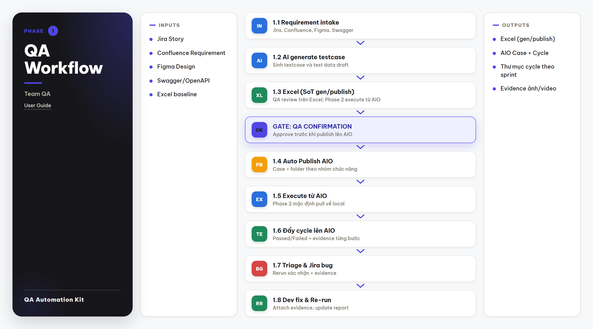
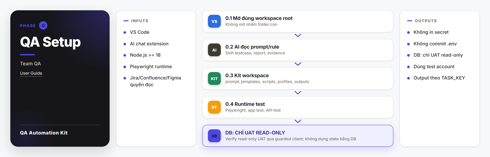
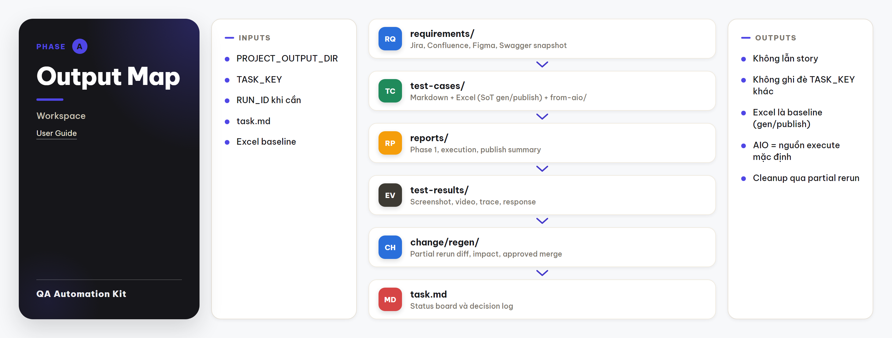
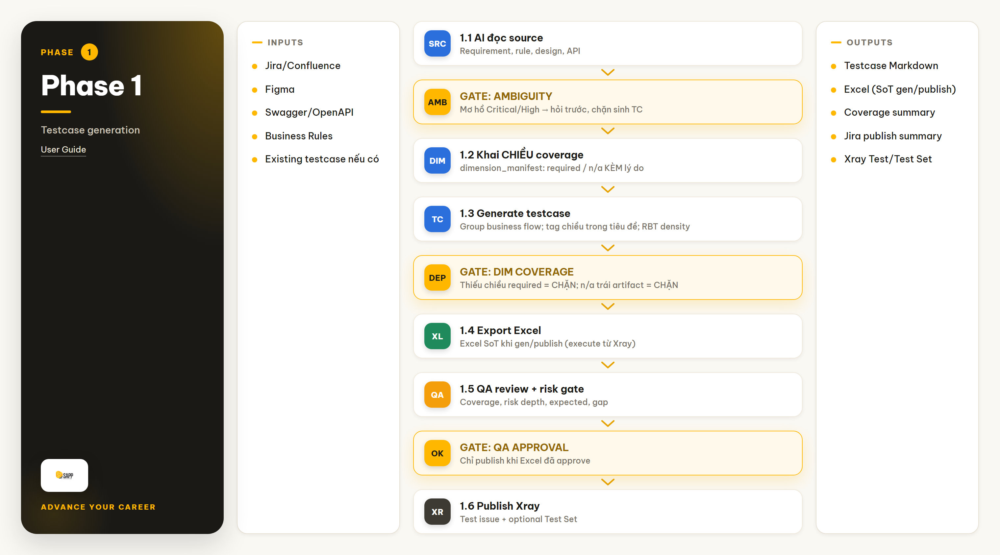
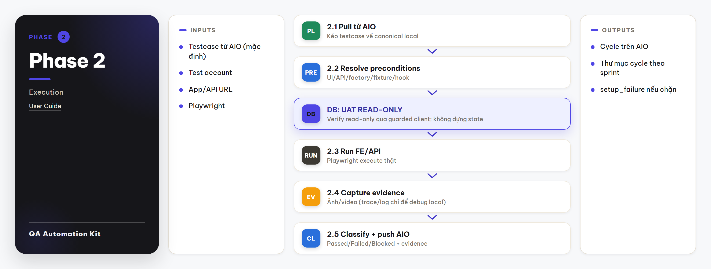
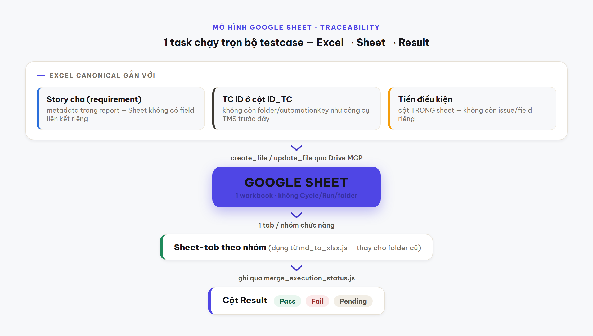
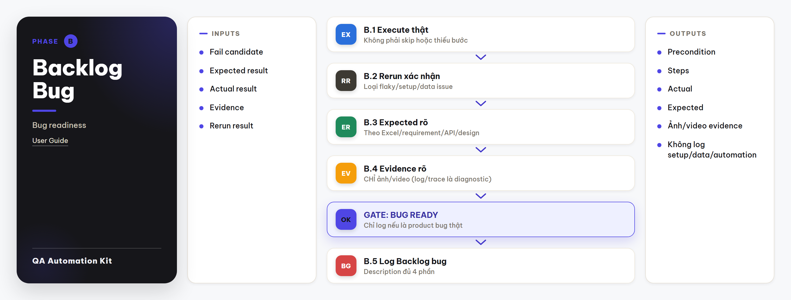
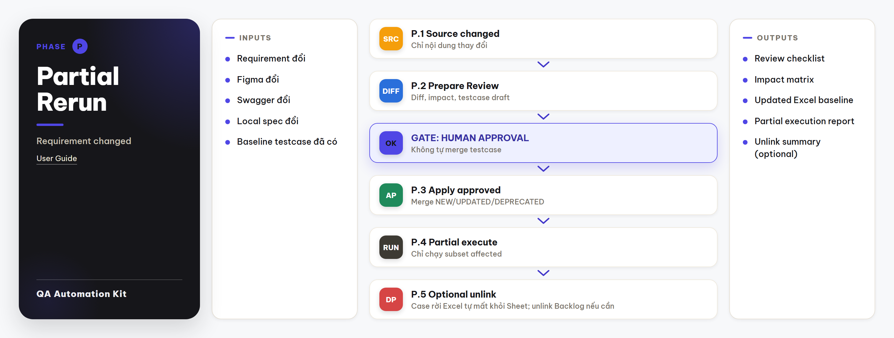
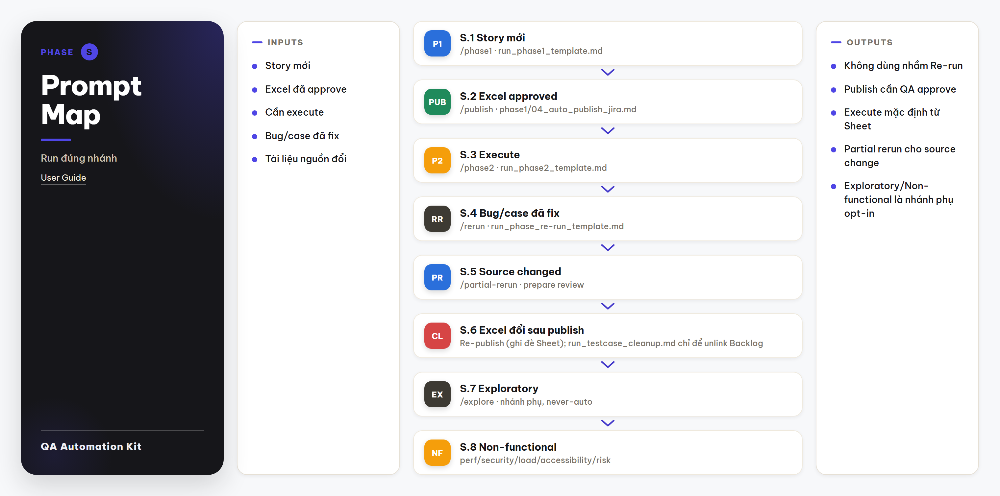
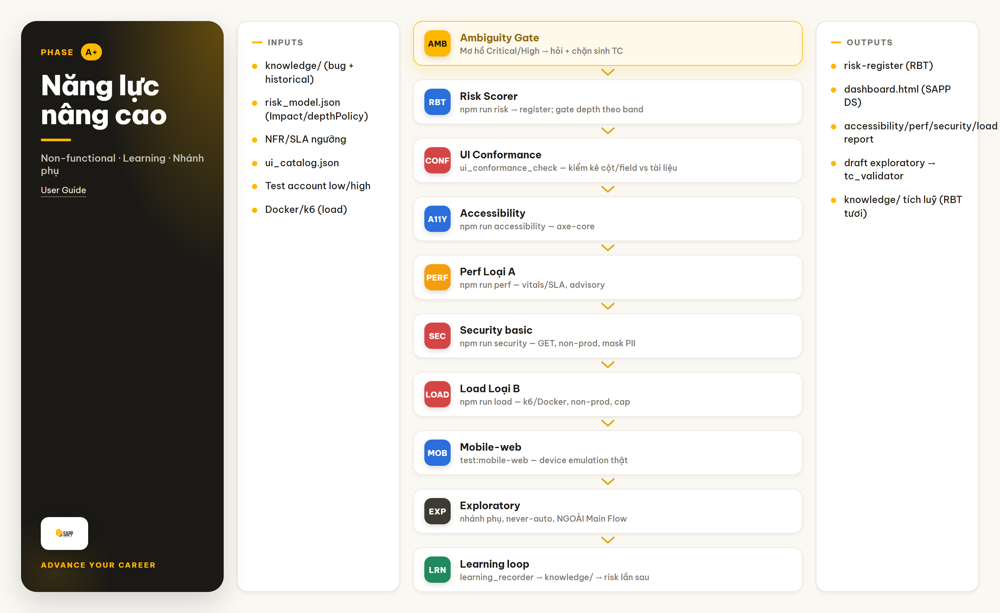

# Hướng dẫn sử dụng Test Automation Kit cho Team QA

> Tài liệu hướng dẫn Team QA sử dụng Test Automation Kit trong Visual Studio Code để sinh testcase, execute automation, review coverage và risk, log bug Backlog và re-run sau khi Dev fix.

## Mục lục

- [1. Tổng quan](#1-tổng-quan)
- [2. Ai dùng tài liệu này?](#2-ai-dùng-tài-liệu-này)
- [3. Chuẩn bị trước khi chạy](#3-chuẩn-bị-trước-khi-chạy)
- [4. Cấu trúc thư mục cần biết](#4-cấu-trúc-thư-mục-cần-biết)
- [5. Quy trình sử dụng chính](#5-quy-trình-sử-dụng-chính)
- [6. Nhánh phụ khi tài liệu thay đổi](#6-nhánh-phụ-khi-tài-liệu-thay-đổi)
- [7. Cách QA Lead review kết quả](#7-cách-qa-lead-review-kết-quả)
- [8. Chạy song song nhiều story](#8-chạy-song-song-nhiều-story)
- [9. Prompt và command thường dùng](#9-prompt-và-command-thường-dùng)
- [10. Lỗi thường gặp và cách xử lý](#10-lỗi-thường-gặp-và-cách-xử-lý)
- [11. Phụ lục](#11-phụ-lục)
- [12. Năng lực nâng cao (Non-functional · Learning · Nhánh phụ)](#12-năng-lực-nâng-cao-non-functional--learning--nhánh-phụ)

## 1. Tổng quan

### 1.1 Test Automation Kit dùng để làm gì?

Test Automation Kit hỗ trợ QA làm việc theo từng story hoặc task:

```text
Requirement
-> Sinh testcase (Excel source of truth)
-> QA review/confirmation
-> Auto publish testcase lên Google Sheet (qua Drive MCP)
-> Execute automation (luôn tải bản Sheet mới nhất trước mỗi lượt)
-> Đồng bộ trạng thái PASS/FAIL vào cột Result trên Sheet
-> Triage bug
-> Log Backlog nếu đủ điều kiện
-> Re-run sau khi Dev fix
```

Kit không thay thế vai trò review của Team QA. AI Agent hỗ trợ đọc tài liệu, tạo testcase, chạy test và tổng hợp report; QA vẫn là người quyết định coverage có đủ, risk có chấp nhận được và bug có đủ điều kiện log Backlog hay chưa.

### 1.2 Main Flow của kit



Main Flow hiện tại:

```text
Phase 1
-> Excel source of truth
-> Review / QA Confirmation
-> Auto Publish testcase lên Google Sheet (qua Drive MCP)
-> Phase 2 Execute (luôn tải bản Sheet mới nhất)
-> Đồng bộ Result (Pass/Fail/Pending) vào Sheet
-> Validation
-> Backlog Bug
-> Dev Fix
-> Re-run
-> PASS
```

Ý nghĩa từng phase:

| Phase | Mục tiêu | Output chính | Ai review |
|---|---|---|---|
| Phase 1 | Sinh testcase từ Backlog/tài liệu nguồn/Figma/Swagger và export Excel source of truth. Auto Publish testcase là step riêng trong Phase 1 sau khi QA xác nhận. | Testcase Markdown, Excel, coverage report, Google Sheet publish summary nếu đã chạy step publish. | QA Member, QA Lead. |
| Review | Kiểm tra coverage, risk và chất lượng testcase. | Quyết định có chạy Phase 2 chưa. | QA Member, QA Lead. |
| Phase 2 | Execute automation thật (luôn tải bản mới nhất từ Google Sheet), giảm skip/fail sai, rồi đồng bộ trạng thái lên Sheet khi QA duyệt. |
| Backlog Bug | Log bug khi fail là product bug thật. | Backlog bug + evidence ảnh/video. | QA Member, QA Lead. |
| Re-run | Chạy lại bug/case fail sau khi Dev fix. | Rerun report, evidence PASS/FAIL. | QA Member, QA Lead khi cần. |

### 1.3 Nguyên tắc quan trọng nhất

| Nguyên tắc | Lý do |
|---|---|
| Không chạy nhầm `TASK_KEY`. | Tránh ghi đè output của story khác. |
| Không chạy Phase 2 khi Phase 1 chưa được review. | Tránh execute sai expected result. |
| Execute luôn tải bản Google Sheet mới nhất qua Drive MCP; Excel là source-of-truth khi gen/publish |
| Không skip case để làm đẹp pass rate. | Report phải phản ánh chất lượng thật. |
| Không log Backlog bug nếu fail do setup/test data/automation. | Tránh tạo noise cho Dev. |
| Không đổi expected result nếu chưa có source xác nhận. | Tránh biến product bug thành pass ảo. |
| Evidence bug phải là ảnh/video. | QA Lead và Dev dễ kiểm chứng lỗi. |

## 2. Ai dùng tài liệu này?

| Vai trò | Nên đọc phần nào | Mục tiêu |
|---|---|---|
| QA Member | Toàn bộ tài liệu, đặc biệt phần 3, 5, 8, 9, 10. | Setup môi trường, chạy từng phase và kiểm tra output. |
| QA Lead | Phần 5, 7, 8, 11. | Review coverage, risk, execution quality và bug readiness. |
| Automation Engineer | Phần 3, 4, 5, 8, 9, 10. | Biết điểm chạm automation, evidence, report và re-run. |

File tổng quan quan trọng nhất để Team QA theo dõi trạng thái story là:

```text
outputs/<project>/tasks/<TASK_KEY>/task.md
```

## 3. Chuẩn bị trước khi chạy

### 3.1 Bộ công cụ cần cài



| Công cụ | Bắt buộc với ai | Dùng để làm gì |
|---|---|---|
| Visual Studio Code | QA Member, QA Lead, Automation | Mở workspace, đọc/sửa Markdown, chạy terminal và dùng AI chat extension. |
| AI chat extension trên VS Code | QA Member, QA Lead, Automation | Gọi AI Agent đọc prompt, sinh testcase, execute, triage và cập nhật report. |
| Claude Code hoặc AI Agent tương đương | QA Member, QA Lead, Automation | Chat với AI trong workspace. Team có thể dùng Claude Code hoặc công cụ đã được cấp quyền nội bộ. |
| Git client | QA Member, QA Lead, Automation | Pull kit mới nhất và push thay đổi lên GitLab/GitHub nếu team yêu cầu. |
| Node.js `>=18` | QA Member, Automation | Chạy script, Playwright và converter Excel. |
| Playwright browser runtime | QA Member, Automation | Execute UI/API automation và tạo evidence. |
| Docker **hoặc** k6 (optional) | Automation | Chỉ cần khi chạy **load test Loại B** (`npm run load`); thiếu thì lệnh tự bỏ qua. Xem mục 12. |
| Quyền Backlog/tài liệu nguồn/Figma/Swagger | QA Member, QA Lead | Đọc requirement/design/API source theo từng story/task. |
| Credential app/API test | QA Member, Automation | Login app, gọi API và tạo/rollback test data. |

QA Member và Automation Engineer cần setup đầy đủ để execute. QA Lead nếu chỉ review report thì không bắt buộc cài Playwright.

### 3.2 Cài Visual Studio Code và AI chat extension

QA dùng VS Code làm nơi mở kit và làm việc với AI Agent.

| Bước | Thao tác |
|---:|---|
| 1 | Cài Visual Studio Code từ trang chính thức hoặc bộ cài nội bộ của team. |
| 2 | Mở VS Code, vào `Extensions`. |
| 3 | Cài AI chat extension team đang dùng, ví dụ Claude Code hoặc extension nội bộ tương đương. |
| 4 | Đăng nhập bằng account/API key được cấp. |
| 5 | Mở root folder của kit, không mở nhầm folder con. |
| 6 | Gửi thử một câu ngắn trong AI chat để kiểm tra AI đọc được workspace. |

Yêu cầu với AI chat extension:

| Yêu cầu | Ghi chú |
|---|---|
| Đọc file trong workspace | Cần để đọc prompt, testcase, report. |
| Ghi file trong workspace | Cần để cập nhật output. |
| Chạy command khi được phép | Cần cho export Excel, Playwright, integration check. |
| Không in secret ra chat/log | Bắt buộc. |
| Kết nối MCP/connector nếu có | Dùng cho tài liệu nguồn/Figma/Google Drive khi team cấu hình. |

### 3.3 Cấu hình MCP server

MCP server giúp AI Agent kết nối trực tiếp với tài liệu nguồn, Figma, Google Drive hoặc Playwright. Nếu team không dùng MCP, QA vẫn có thể chạy kit bằng link, file export hoặc script integration hiện có (Backlog dùng REST trực tiếp qua `scripts/integrations/backlog/`, không cần MCP); tuy nhiên MCP giúp AI đọc source nhanh và ổn định hơn.

File template MCP của kit:

```text
.agent/config/mcp_config.md
```

Các MCP server thường dùng:

| Server | Dùng để làm gì | Khi nào cần |
|---|---|---|
| — | Không còn MCP server cho tài liệu/bug tracking. Backlog dùng REST riêng; requirement/tài liệu BA đọc từ file Markdown trong task folder (đưa sang từ Obsidian vault). | — |
| `figma` | Đọc Figma design. | Scope có UI/design cần đối chiếu field, flow, validation. |
| Google Drive (connector có sẵn) | Publish/tải testcase Google Sheet, đọc Google Doc. | Mọi lượt Auto Publish testcase (Phase 1) và execute (Phase 2) — không cần khai trong `mcp_config.md`, đã kết nối sẵn. |
| `playwright` | Inspect browser qua MCP. | Cần hỗ trợ đọc UI runtime, locator hoặc debug interaction. |

#### 3.3.1 Setup MCP local

Các bước cấu hình MCP:

| Bước | Thao tác |
|---:|---|
| 1 | Mở `.agent/config/mcp_config.md` và copy block JSON template. |
| 2 | Dán JSON vào MCP settings local của VS Code/AI extension đang dùng. |
| 3 | Đảm bảo mọi API key/token nằm trong `.env`, `.env.local` hoặc MCP settings local; không ghi token vào Markdown dùng chung. |
| 4 | Reload VS Code hoặc restart AI chat extension để MCP server được load lại. |
| 5 | Yêu cầu AI gọi thử 1 lệnh đọc nhẹ nhất của server vừa bật, không in token ra output. |

#### 3.3.2 Nguyên tắc bảo mật

| Rule | Lý do |
|---|---|
| Chỉ trỏ MCP vào môi trường test. | Tránh đọc/ghi nhầm dữ liệu production. |
| Không commit MCP settings chứa secret. | Tránh lộ token/API key. |
| Không paste token vào chat hoặc report. | Tránh lộ secret trong log. |
| Không sửa `.agent/config/mcp_config.md` bằng token thật. | File này là template dùng chung. |
| Token bị lộ phải rotate ngay. | Token cũ không còn an toàn. |

#### 3.3.3 Lỗi thường gặp

| Lỗi | Nguyên nhân hay gặp | Cách xử lý |
|---|---|---|
| MCP server không start | Node.js thiếu, package không tải được hoặc command sai theo OS. | Kiểm tra `node -v`, `npm -v`, reload VS Code và xem MCP log của extension. |
| Không đọc được Figma | `FIGMA_API_KEY` thiếu quyền hoặc link/node sai. | Kiểm tra quyền file Figma và token. |
| AI vẫn không thấy MCP | Chưa reload IDE hoặc MCP settings đặt sai scope. | Reload VS Code, mở lại workspace root và kiểm tra MCP server list trong extension. |

### 3.4 Đồng bộ kit bằng GitLab/GitHub

Nếu kit được quản lý trên GitLab/GitHub, QA cần biết pull và push cơ bản.

Trước khi bắt đầu làm việc:

```bash
git pull
```

Sau khi sửa tài liệu/prompt/script và cần đẩy lên repo:

```bash
git status
git add <file-da-sua>
git commit -m "docs: update qa user guide"
git push
```

Quy tắc:

| Quy tắc | Lý do |
|---|---|
| Pull trước khi sửa | Tránh làm việc trên version cũ. |
| Không commit `.env` hoặc secret | Tránh lộ token/password. |
| Không commit artifact lớn nếu team không yêu cầu | Tránh làm repo nặng. |
| Resolve conflict cẩn thận | Không làm mất prompt/rule của người khác. |
| Nếu không chắc quyền push | Hỏi QA Lead hoặc repo owner. |

Nếu team không yêu cầu QA push code, QA vẫn nên pull kit mới nhất trước khi chạy workflow.

### 3.5 Cài Node.js, dependencies và Playwright

```bash
npm install
npx playwright install
node -v
npm -v
npx playwright --version
```

Kiểm tra integration nếu cần:

```bash
npm run integration:check
```

### 3.6 Cấu hình env và quyền truy cập

Copy file mẫu nếu project chưa có env local:

```text
.env.example -> .env.local
```

Hoặc dùng `.env` nếu team đã thống nhất như vậy.

Nhóm config thường gặp:

| Nhóm config | Dùng để làm gì |
|---|---|
| `PROJECT_OUTPUT_DIR` | Output root của project. |
| `TASK_KEY` | Scope story/task hiện tại, chỉ dùng khi user đã xác nhận. |
| `BACKLOG_*` | Đọc Backlog và log bug. |
| `FIGMA_*` | Đọc Figma hoặc design summary. |
| `GOOGLE_SHEET_URL` | Link Google Sheet đã publish testcase (ghi vào `profiles/<TASK_KEY>/task.env` sau Phase 1). |
| `OPS_BASE_URL`, `OPS_LOGIN_URL` | URL app cần test. |
| `OPS_USERNAME`, `OPS_PASSWORD` | Account test. |
| `*_API_BASE_URL`, `*_SWAGGER_URL` | API automation và Swagger/OpenAPI. |

Khi chạy song song nhiều task, chỉ để **giá trị tĩnh** (Figma/tài liệu nguồn/Backlog API key + base URL, `OPS_*`) ở `.env` chung; `GOOGLE_SHEET_URL` là giá trị động, để trong `profiles/<TASK_KEY>/task.env`.

Không cấu hình DB credential và connection string generic (`TEST_DB_*`, `TEST_DATABASE_URL`, `DATABASE_URL`, `PG*`) và **không dựng state bằng DB**. Ngoại lệ DUY NHẤT: read-only verify/chẩn đoán trên **UAT DB** qua guarded client `tests/support/setup/db/uatDbClient.ts` (biến `LIB_MASTER_DB_*`, read-only: chỉ SELECT, chặn bằng lint trong client) — dùng để khoanh tầng lỗi (vd "field trống do FE hay BE?") khi API/UI không đủ. Kho UAT/PROD tách biệt: chỉ cấu hình creds kho UAT, không cấu hình thì không truy cập. Ghi DB thẳng bỏ qua business logic nên DB chỉ để chẩn đoán, KHÔNG dựng state, KHÔNG phải evidence Backlog; PII đọc ra phải mask + không export file. Case cần **dựng** trạng thái backend sâu vẫn bị chặn vì **thiếu capability an toàn (test hook/API/sandbox)** và đánh dấu `Needs hook`/`Manual-only` (xem `tests/support/setup/hooks/README.md`).

Không copy token và password vào Markdown, report, testcase, chat hoặc Backlog description.

### 3.7 Thông tin bắt buộc trước mỗi lần chạy

Mỗi lần yêu cầu AI chạy workflow, luôn nêu rõ:

| Thông tin | Ghi chú |
|---|---|
| Project output | Dùng `outputs/<YOUR_PROJECT>`, không hardcode theo một project cụ thể. |
| Task key | Dùng `<TASK_KEY>` của story/task hiện tại. |
| Module/feature | Tên module hoặc feature của story/task hiện tại. |
| Phase cần chạy | Phase 1, Phase 2, Re-run hoặc Partial Rerun. |
| Backlog Epic/Story/Task | Link Backlog đúng với story/task hiện tại. |
| tài liệu nguồn Requirement | Link tài liệu nguồn riêng của story/task hiện tại. |
| Figma | Link Figma/file/node riêng của story/task hiện tại nếu scope có UI/design. |
| Swagger/OpenAPI | Link Swagger/OpenAPI riêng hoặc endpoint docs liên quan tới story/task hiện tại. |
| App/API URL | URL môi trường test liên quan tới story/task hiện tại. |
| Scope bổ sung | User story, TC ID, bug key, endpoint hoặc màn hình nếu có. |

Mỗi story hoặc task có thể có Backlog, tài liệu nguồn, Figma và Swagger khác nhau. Không dùng lại link của story trước nếu user chưa xác nhận đó vẫn là source đúng cho story/task hiện tại.

AI Agent phải echo lại trước khi ghi file hoặc chạy command:

```text
PROJECT_OUTPUT_DIR=<value>
TASK_KEY=<value>
TASK_OUTPUT_DIR=<PROJECT_OUTPUT_DIR>/tasks/<TASK_KEY>
RUN_ID=<value-or-N/A>
Phase=<phase đang chạy>
```

Nếu `TASK_KEY` không khớp yêu cầu hiện tại, phải dừng ngay.

## 4. Cấu trúc thư mục cần biết

### 4.1 Folder chính của kit

```text
test-automation-kit_v2/
├── .claude/commands/     # slash command: /phase1 /phase2 /rerun … (xem Mục 9.0)
├── .agent/
├── prompt_templates/
├── partial-rerun/
├── manual-run/
├── scripts/
├── tests/
├── profiles/
├── outputs/
├── README.md
├── QUICKSTART.md
├── USER_GUIDE.md
└── RULE_GLOBAL.md
```

| Folder/File | Dùng để làm gì |
|---|---|
| [docs/UPGRADE.md](docs/UPGRADE.md) | **Nâng bản kit** — đọc số version để biết có phải sửa lớp PROJECT không; ghi đè GENERIC, giữ PROJECT; sau khi nâng chạy `preflight` + `gate:policy`. |
| `.claude/commands/` | **Slash command** — điểm vào chuẩn hoá cho 10 luồng (xem Mục 9.0). Chỉ `commands/` được commit; `settings*.json` là cấu hình máy cá nhân. |
| `.agent/` | Workflow, skill (23), rule và config cho AI Agent. `config/db.conventions.json` giữ quy ước DB + bản đồ cột↔nhãn khoá **theo màn**; `config/locators.schema.json` là schema cho `knowledge/locators/`. |
| `prompt_templates/` | Prompt chạy Phase 1, Phase 2 và Re-run. Bên trong `phase1/dimensions/` là **20 chương chiều coverage** (§3–§23, gồm §22 inbound callback và §23 DB persistence) — mở đúng chiều task khai `required`, không nạp cả 20 (xem mục 5, bước sinh testcase). |
| `partial-rerun/` | Nhánh phụ khi tài liệu requirement/design/API thay đổi. |
| `manual-run/` | Nhánh phụ chạy tay case khai `[manual]`, để chúng có verdict thật thay vì nằm mãi ở `SKIP_SETUP`. Xem Mục 9.0. |
| `scripts/` | Script export Excel, Backlog/Google Doc/Sheet integration, Playwright helper. |
| `tests/` | Regression spec/shared automation; `tests/support/setup/` là setup layer dùng chung (factory/hook/fixture/mock/cleanup/contract). |
| `profiles/` | Env động theo từng task (`profiles/<TASK_KEY>/task.env`, nạp qua `TASK_ENV`); tạo bằng `npm run profile:create -- <TASK_KEY>`. Giá trị tĩnh vẫn ở `.env` chung. |
| `tests/support/setup/db/` | **DB Verification Layer (§23)** — đọc bản ghi dưới DB sau khi UI đổi dữ liệu để khoanh tầng lỗi (UI đúng + DB sai = bug BE; UI sai + DB đúng = bug FE). Read-only tuyệt đối, và `preflight` chặn ở cửa vào nếu task khai dùng §23 mà thiếu config/creds. |
| `outputs/` | Toàn bộ artifact theo project/task. |
| `README.md` | Tổng quan architecture. |
| `QUICKSTART.md` | Setup nhanh. |
| `USER_GUIDE.md` | Hướng dẫn sử dụng theo vai trò. |
| `RULE_GLOBAL.md` | Quy tắc global. |

### 4.2 Output của từng story/task



Mọi artifact của một story nằm dưới:

```text
<PROJECT_OUTPUT_DIR>/tasks/<TASK_KEY>/
```

Ví dụ chung:

```text
outputs/<YOUR_PROJECT>/tasks/<TASK_KEY>/
```

Output map:

```text
outputs/<project>/tasks/<TASK_KEY>/
├── requirements/
├── test-cases/
│   ├── *.md
│   ├── *.xlsx                     # Excel gen ở Phase 1 (source khi gen/publish; chính là nội dung Sheet)
│   ├── from-sheet/                # canonical tải từ Google Sheet qua Drive MCP (nguồn execute mặc định)
│   │   └── <TASK_KEY>_from_sheet.xlsx
│   └── snapshot_context.json
├── test-results/
│   ├── execution-results.md
│   ├── results.json
│   ├── testcase-status.json       # trạng thái từng TC để đồng bộ lên Sheet (theo verdict_taxonomy.json)
│   ├── artifacts/
│   └── playwright-report/
├── reports/
│   ├── phase1-summary.md
│   ├── execution-summary.md
│   ├── backlog-testcase-publish-summary.md # publish: file tạo/cập nhật trên Drive (agent tự ghi)
│   ├── aio-execution-summary.md   # đồng bộ Result lên Sheet: verdict, case bị loại + lý do (agent tự ghi)
│   ├── backlog-testcase-cleanup-summary.md # unlink Test↔Story/Task trên Backlog nếu có (agent tự ghi)
│   └── rerun/
├── change/
└── task.md
```

### 4.3 File Team QA nên mở trước

| Cần xem | File |
|---|---|
| Trạng thái tổng quan story | `task.md` |
| Testcase và coverage | `reports/phase1-summary.md` |
| Testcase chi tiết | `test-cases/*.md` hoặc `*.xlsx` |
| Kết quả execute | `reports/execution-summary.md` |
| Log chi tiết execute | `test-results/execution-results.md` |
| Evidence | `test-results/artifacts/` |
| Kết quả re-run | `reports/rerun/` |

## 5. Quy trình sử dụng chính

### 5.1 Bước 0 - Xác định scope

Trước khi chạy, QA cần xác định:

| Câu hỏi | Ghi chú |
|---|---|
| Story/task nào? | Luôn nêu rõ `<TASK_KEY>` của story/task hiện tại. |
| Module nào? | Nêu module/feature theo story/task hiện tại. |
| Đang chạy phase nào? | Phase 1, Phase 2, Re-run hoặc Partial Rerun. |
| Nguồn requirement là gì? | Backlog, tài liệu nguồn, Figma, Swagger hoặc file local của story/task hiện tại. |
| Có giới hạn scope không? | User story, TC ID, bug key, endpoint hoặc màn hình cụ thể nếu có. |
| Link source đã đúng story chưa? | Mỗi story/task thường có link Backlog, tài liệu nguồn, Figma và Swagger riêng; xác nhận trước khi chạy. |

Prompt mẫu:

```text
Đọc và chạy file prompt_templates/run_phase1_template.md.
Chỉ chạy Phase 1 để sinh testcase.
Task key là <TASK_KEY>.
```

> **Chỉ cần trỏ vào `run_phase*_template.md` — không phải liệt kê từng prompt bước.** Từ 13/08/2026 mỗi
> `run_phase` mở đầu bằng **Bản đồ prompt** (prompt nào bắt buộc, mở khi nào) + **bảng Gate bắt buộc chạy**
> (lệnh nào, chặn cái gì) + con trỏ tới workflow tổng quan của phase. Trước đó `run_phase2` **không** trỏ tới
> `phase2/04_execute_fe_playwright.md` và 11 lệnh gate chỉ nằm ở `.agent/workflows/` — ai theo đúng điểm vào
> là bỏ sót chúng. Nay có gate máy canh cả hai chiều nên chuỗi không hở lại được.

### 5.2 Phase 1 - Sinh testcase

Mục tiêu: tạo bộ testcase đủ chi tiết để Team QA review và dùng cho Phase 2.

**Trước khi đọc tài liệu, soát xem nó có lành không.**
Tài liệu hỏng không tự báo là nó hỏng. File vẫn có chữ, vẫn có tiêu đề, đọc vào vẫn hợp lý.

```bash
npm run docs:index  -- --task <TASK_KEY>     # lập chỉ mục neo BR/AC/EC/NFR
npm run docs:cite   -- --task <TASK_KEY> BR-07   # ra file kèm SỐ DÒNG
```

| Phép đo | Nghĩa là gì | Làm gì |
|---|---|---|
| **LỆCH BẢN** | tài liệu nguồn đã sửa sau ngày fetch | Đọc lại phần đã đổi trước khi gen |
| **RỔNG** | Fetch về không có thân bài, không báo lỗi | Fetch lại |
| **MẤT BẢNG** | Nguồn có bảng, file không còn dòng bảng nào | Fetch lại. **AC của dự án này nằm trong bảng** |
| **CÒN ENTITY** | Chữ còn dạng `&agrave;` thay vì `à` | Fetch lại. Tìm "trên" sẽ không khớp `tr&ecirc;n` |

Mất bảng là lớp lỗi im lặng tệ nhất. Bạn đọc spec mà **không thấy điều kiện chấp nhận**.
Không tín hiệu nào báo. Đo trên một task thật: 12 trên 12 trang có bảng ở nguồn mà file fetch về
còn 0 dòng bảng. 66 trên 66 dòng AC viết bằng Gherkin bị xóa sạch.

`docs:cite` dùng khi muốn biết một neo nằm ở đâu.
Nó còn báo **MƠ HỒ** khi cùng một mã mang luật khác nhau giữa các trang.
Đo thật: `NFR-02` một bên là "kỳ khoá sổ", bên kia là "chênh lệch deferred revenue".
Trích trần `NFR-02` chưa chỉ ra được luật nào. Viết kèm trang, kiểu `US-01 BR-07`.

Prompt:

```text
prompt_templates/run_phase1_template.md
```

Output bắt buộc:

| Output | Đường dẫn |
|---|---|
| Requirement artifact | `<PROJECT_OUTPUT_DIR>/tasks/<TASK_KEY>/requirements/` |
| Testcase Markdown | `<PROJECT_OUTPUT_DIR>/tasks/<TASK_KEY>/test-cases/*.md` |
| Testcase Excel source of truth | `<PROJECT_OUTPUT_DIR>/tasks/<TASK_KEY>/test-cases/*.xlsx` |
| Phase 1 report | `<PROJECT_OUTPUT_DIR>/tasks/<TASK_KEY>/reports/phase1-summary.md` (gồm `### Setup Readiness` + `### Precondition Execution Matrix`) |
| Capability / Test-Hook Request | `<PROJECT_OUTPUT_DIR>/tasks/<TASK_KEY>/reports/capability-request.md` (handoff Dev khi còn `Needs hook`/`Manual-only`) |
| Cách dựng precondition | Tag `[<method>]` ngay trong cell `Tiền điều kiện` của từng TC; chi tiết theo task ở `### Setup Readiness` của `reports/phase1-summary.md` |
| Task log | `<PROJECT_OUTPUT_DIR>/tasks/<TASK_KEY>/task.md` |

Testcase tốt cần có:

| Thành phần | Yêu cầu |
|---|---|
| Trace | Có requirement/user story/API behavior liên quan. |
| Preconditions | Nêu rõ điều kiện trước khi test. |
| Test data | Có dữ liệu cần dùng hoặc cách tạo dữ liệu. |
| Steps | Rõ ràng, executable. |
| Expected result | Cụ thể, validate đúng business rule. |
| Assertion intent | Biết cần assert UI/API/side-effect nào. |
| Risk | Có priority/risk phù hợp. |
| Nhóm chức năng | Dễ lọc trong Excel theo module/feature/API/flow. |

Bắt buộc thêm (để Phase 2 không phải đoán tiền điều kiện):
- Mỗi cell `Tiền điều kiện` có dạng `[<method>] <mô tả trạng thái>` — method ∈ `api`|`factory`|`test_hook`|`ui`|`pre_existing`|`manual` (KHÔNG có `db`). Precondition là MỘT TRƯỜNG của testcase: không còn mã riêng, không còn sheet riêng.
- `### Precondition Execution Matrix` trong `phase1-summary.md`: 1 dòng/TC để biết case nào automatable (`Ready`), cần hook (`Needs hook`), hay blocked (`Manual-only`).
- Chi tiết schema: skill `precondition_setup_planner` và `prompt_templates/phase1/02_gen_testcases.md`.

**Bắt buộc thêm — CHIỀU coverage (từ 14/08/2026):** bộ testcase có **hai trục**. *Module* trả lời "test **ở đâu**"; *chiều* trả lời "hỏi **loại câu hỏi nào**" (validate field · định dạng hiển thị · công thức tiền · BE trả gì · guard và quyền · bảo mật · hiệu năng · ảnh hưởng lan). Phủ kín module mà **trống hẳn một chiều** thì bộ vẫn *trông* đầy đủ — đo trên một bộ 530 case thật: **E2E 0 case**, **change-impact 0–1**, case hiển thị **≈12%** dù mục đó là BẮT BUỘC.

Ba việc phải làm, theo thứ tự:

| # | Việc | Lệnh / nơi đọc |
|---|---|---|
| 1 | **Khai phạm vi chiều TRƯỚC khi gen** — `requirements/dimension_manifest.json`: mỗi chiều `"required"` hoặc `"n/a"` **kèm lý do**. Khai `n/a` cho chiều mà artifact chứng minh là có (vd có `requirements/figma/**` mà khai `design: n/a`) ⇒ **CHẶN** | `npm run dim:coverage` (chạy không `--enforce` để lấy khung manifest) |
| 2 | **Mở đúng chương của các chiều `required`** — 20 chương, mỗi chương nói "chiều này phải sinh case gì". Không nạp cả 15 | [`prompt_templates/phase1/dimensions/`](prompt_templates/phase1/dimensions/) |
| 3 | **Gắn tag chiều trong tiêu đề case** + expected phải mang **bằng chứng** của chiều đó (`[Calc]` → giá trị số tự tính · `[Display]` → chuỗi trích nguyên văn/định dạng/danh sách cột · `[Guard]` → mã 4xx **kèm** "dữ liệu không đổi"…) | prompt gen §0b và §0b-bis |

Ví dụ tiêu đề đúng: `[Positive][Calc][BR-RECIPBANK-001] TK nhận theo chương trình + mốc 01/01/2026`
— tag loại · tag chiều · id rule làm oracle.

Kiểm trước khi đưa QA duyệt: `npm run dim:coverage -- --enforce` (thiếu chiều `required` = chặn) và `npm run domain:trace-back` (case có oracle nghiệp vụ mà không trỏ rule nào). **Bộ chưa gắn tag thì gate tự từ chối chặn** — đó là trạng thái *chưa được gác*, không phải *đã đạt*.

Phase 1 không được execute automation.

Sau khi Excel tạo thành công, prompt sinh testcase dừng ở trạng thái `Testcase publish (Google Sheet): Pending QA confirmation`.

### 5.3 Review sau Phase 1



Team QA review các file:

```text
task.md
reports/phase1-summary.md
test-cases/*.md
test-cases/*.xlsx
```

Quality gate:

| Điều kiện | Yêu cầu |
|---|---|
| Requirement coverage | Tối thiểu `>= 80%`. |
| Core/high-risk flow | Phải được cover đầy đủ. |
| Critical/High gap | Không còn open gap, hoặc có risk owner accept rõ. |
| Testcase quan trọng | Không bị thiếu hoặc quá chung chung. |
| Negative/error case | Được cover nếu nằm trong scope. |
| Excel | Export thành công và lọc được theo nhóm. |
| Google Sheet publish | Chỉ chạy sau QA confirmation; nếu chưa approve thì trạng thái phải là `Pending QA confirmation`. |
| Setup Readiness | Mỗi precondition có tag `[<method>]` đủ để setup qua UI/API/fixture/hook an toàn; `test_hook` = cần Dev mở hook, `manual` = không tự động hoá được (phải nêu lý do) |

> **Ép bằng máy (forcing functions round-3):** `npm run preflight` (config và input đủ) · `npm run design:gate -- --dir test-cases/ --with-rows` (đủ cột / không rỗng ô lõi / oracle) · gate gen-testcase TỰ CHẠY khi convert · `npm run self-review -- --task <TASK_KEY>` (checklist gộp trước finalize). Chi tiết `scripts/qa/README.md`.

Final Decision hợp lệ:

| Status | Ý nghĩa |
|---|---|
| `PASS` | Có thể chuyển Phase 2. |
| `CONDITIONAL PASS` | Có thể chạy với điều kiện/risk rõ. |
| `FAIL` | Cần bổ sung/xác nhận trước khi chạy Phase 2. |
| `BLOCKED` | Thiếu input/quyền/source nên chưa hoàn tất. |

Không kết luận PASS chỉ vì coverage số học cao. Nếu còn gap Critical/High chưa xử lý thì không nên PASS.

Auto Publish testcase trong Phase 1:

```text
Đọc và chạy file prompt_templates/phase1/04_auto_publish_backlog.md.
Task key là <TASK_KEY>.
QA confirmation Status = APPROVED.
```

Step này đọc Excel source of truth trong `test-cases/*.xlsx` rồi publish lên **Google Sheet** qua Drive MCP: agent `search_files` tìm Sheet đã có (theo `GOOGLE_SHEET_URL`), rồi `create_file`/`update_file` — review nội dung local trước khi ghi đè.

Nếu Excel thay đổi sau khi đã publish, chỉ cần re-publish (ghi đè Sheet) là đủ — không cần cleanup lifecycle riêng. Chỉ dùng nhánh phụ `partial-rerun/run_testcase_cleanup.md` nếu cần unlink Test↔Story/Task trên Backlog sau Human Review.

### 5.4 Chờ Dev implement

Thông thường QA không chạy một mạch cả flow. Sau Phase 1, cần chờ Dev implement xong scope tương ứng.

Trước khi sang Phase 2, QA nên xác nhận:

| Check | Câu hỏi |
|---|---|
| Dev status | Story đã deploy lên môi trường test chưa? |
| Scope | Scope implement có khớp testcase đã sinh không? |
| Env | App/API test có hoạt động không? |
| Account | Account/role test có đủ quyền không? |
| Data | Test data có thể tạo/rollback an toàn không? |

### 5.5 Phase 2 - Execute automation



Prompt:

```text
prompt_templates/run_phase2_template.md
```

Prompt mẫu:

```text
Đọc và chạy file prompt_templates/run_phase2_template.md để execute Phase 2.
Task key là <TASK_KEY>.
Nguồn testcase mặc định là Google Sheet: agent tải bản mới nhất qua Drive MCP về local rồi execute. Đặt TESTCASE_SOURCE=excel nếu muốn chạy thuần Excel local (chưa publish).
Nếu có bug thì tạm thời chưa log Backlog, chỉ report local.
Mặc định (PUSH_EXECUTION=confirm): khi cycle execute conclusive, trình preview cho QA duyệt rồi mới ghi đè Sheet thật; =auto để đồng bộ ngay, =0 để tắt.
```

Output bắt buộc:

| Output | Đường dẫn |
|---|---|
| Playwright result | `<PROJECT_OUTPUT_DIR>/tasks/<TASK_KEY>/test-results/` |
| Evidence | `<PROJECT_OUTPUT_DIR>/tasks/<TASK_KEY>/test-results/artifacts/` |
| Execution result | `<PROJECT_OUTPUT_DIR>/tasks/<TASK_KEY>/test-results/execution-results.md` |
| Execution summary | `<PROJECT_OUTPUT_DIR>/tasks/<TASK_KEY>/reports/execution-summary.md` |
| Trạng thái TC (máy đọc, để đồng bộ lên Sheet) | `<PROJECT_OUTPUT_DIR>/tasks/<TASK_KEY>/test-results/testcase-status.json` |
| Sync log (khi `PUSH_EXECUTION` ≠ 0) | `<PROJECT_OUTPUT_DIR>/tasks/<TASK_KEY>/reports/aio-execution-summary.md` |
| Task log | `<PROJECT_OUTPUT_DIR>/tasks/<TASK_KEY>/task.md` |

**Bước đầu Phase 2 (mặc định)** — agent tải testcase từ Google Sheet về canonical local trước khi execute:

Agent `mcp__claude_ai_Google_Drive__download_file_content` file Sheet theo `GOOGLE_SHEET_URL` trong `profiles/<TASK_KEY>/task.env`, ghi `test-cases/from-sheet/<TASK_KEY>_from_sheet.xlsx`.

> **Sheet luôn được tải MỚI trước mỗi lượt execute** — không còn khái niệm mirror cũ hay staleness như công cụ TMS trước đây, vì mỗi lần đều tải lại bản hiện tại.

Cần Phase 1 đã publish testcase lên Google Sheet (`GOOGLE_SHEET_URL` có trong profile). Nếu chưa publish → publish trước, hoặc tạm `TESTCASE_SOURCE=excel`. Nếu report cảnh báo TC thiếu steps thì DỪNG và báo user.

Trước khi generate hoặc execute, Phase 2 chạy **Precondition Resolution Pass**: đọc **tag `[<method>]`** ở đầu mỗi cell `Tiền điều kiện` → setup/verify/cleanup qua setup layer `tests/support/setup/` (api/factory/test_hook/ui/pre_existing) hoặc bỏ sang `manual`; chi tiết dựng theo task ở `### Setup Readiness` của `phase1-summary.md`, recipe tái dùng ở `knowledge/setup_recipes/`. Fail ở tầng này là `setup_failure`, KHÔNG phải product bug.

Nguyên tắc Phase 2:

| Chủ đề | Rule |
|---|---|
| Nguồn testcase | Mặc định tải testcase từ Google Sheet về `test-cases/from-sheet/*.xlsx` rồi execute từ đó (canonical local); đặt `TESTCASE_SOURCE=excel` để dùng Excel local. |
| Precondition | Setup theo **tag `[<method>]`** trong cell `Tiền điều kiện` (api/factory/test_hook/ui/pre_existing/manual) qua capability an toàn — KHÔNG bằng DB; chỉ `manual` mới skip vì setup. |
| Execute thật | Không pass ảo bằng skip/mock sai/sửa expected tùy tiện. |
| Skip | Hạn chế tối đa, mỗi skip phải có lý do và khả năng fix. |
| Fail | Phải phân loại root cause. |
| Rerun | Fail/skip do setup/automation/data phải sửa rồi chạy lại. |
| Evidence | Ảnh/video không được trắng. Case phức tạp nên có video. |
| Assertion | Không xóa assertion quan trọng để tăng pass rate. |

### 5.5.0 Mô hình Google Sheet (traceability) — team tham chiếu

Một task chạy trọn bộ testcase cùng lúc. Testcase management giờ là **Google Sheet qua Drive MCP** — mô hình **phẳng**: Excel canonical → upload nguyên file → Sheet có 1 tab cho mỗi nhóm chức năng. Không còn Test Set, Test Plan, Precondition issue, folder, Cycle hay Run như công cụ TMS trước đây (lịch sử: kit từng dùng Google Sheet, migrate sang Sheet để không phụ thuộc app Backlog Marketplace).



| Lớp | Vai trò | Kit làm gì |
|---|---|---|
| **Excel canonical** | Nguồn sự thật của testcase | `md_to_xlsx.js` xuất từ Markdown; sửa nội dung LUÔN làm ở đây rồi re-publish |
| **Sheet** | Bản đồng bộ hiển thị trên Drive | Agent `create_file`/`update_file` qua Drive MCP — ghi đè NGUYÊN file, không có API "sửa 1 ô" |
| **Sheet-tab theo nhóm chức năng** | Tổ chức case theo nhóm | 1 tab/nhóm, dựng TỪ Excel (`md_to_xlsx.js`); TC ID nằm ở cột `ID_TC` |
| **Tiền điều kiện** | Cách dựng state | Cột `Tiền điều kiện` ngay trong sheet, dạng `[<method>] <mô tả>` — không còn field/issue riêng như trước |
| **Cột `Result`** | Kết quả execute | Ghi qua `merge_execution_status.js` (Pass/Fail/Pending) rồi agent `update_file` đẩy lên Drive |

- **Excel là canonical, Sheet chỉ phản chiếu** — sửa thẳng trên Sheet sẽ mất ở lần ghi đè kế tiếp.
- **Không cần lifecycle Deprecated**: case rời khỏi Excel thì tự động không còn trên Sheet ở lần `update_file` kế tiếp — không có bước "cleanup" riêng như công cụ cũ.
- **Publish chỉ làm được trong phiên chat** (Drive MCP không gọi được từ script CLI/CI headless) — đổi lại không còn quản lý token và rate-limit của TMS riêng. Chi tiết mô hình: [`.agent/skills/shared/backlog_testcase_publisher/SKILL.md`](.agent/skills/shared/backlog_testcase_publisher/SKILL.md).

### 5.5.1 Đầu sprint — không phải tạo gì

Sheet không có Test Plan/sprint folder, nên **không có bước "QA tạo Test Plan đầu sprint"**. Muốn ghi chú theo sprint thì thêm cột hoặc tab riêng trong chính workbook nếu team cần, không phải cấu trúc bắt buộc của kit.

Case cũng không có assignee (Sheet không phải issue tracker) — muốn ghi người chạy thì để trong `comment` của test-result.

### 5.5.2 Đồng bộ kết quả lên Google Sheet

Sau execute, Phase 2 ghi `test-results/testcase-status.json` rồi đồng bộ vào cột `Result`. Mặc định `PUSH_EXECUTION=confirm`: ghi vào bản `.xlsx` local trước, QA duyệt preview, chỉ `update_file` lên Sheet thật sau khi QA xác nhận.

```text
node scripts/convert_excel/merge_execution_status.js <local .xlsx> test-results/testcase-status.json
```
→ agent soi lại file đã merge → `mcp__claude_ai_Google_Drive__update_file` đẩy lên Drive.

| Khái niệm | Ý nghĩa |
|---|---|
| Ghi đè | Mỗi lần đồng bộ là ghi đè lại đúng cột `Result` của case khớp `tcId` — không đụng ô khác (Test Type/Priority/ghi chú QA) |
| Trạng thái | Lấy từ **1 nguồn** `.agent/config/verdict_taxonomy.json` (cột `sheet`) → `Pass` / `Fail` / `Pending` |
| Hai gate trước khi ghi | (1) `output_gate` chất lượng output; (2) **mở rộng 5 trục** — task có case band *high* đã execute mà chưa có `reports/expansion-plan.md` thì CHẶN. Cố ý bỏ qua: `--qa-approved` |
| An toàn | Run **0 conclusive** (toàn Not Run) không ghi đè (`--force` nếu vẫn muốn); case `carriedOver` của lượt trước tự bị loại (`--include-carried-over` để giữ) |

Schema: `{ "tests": [ { "tcId", "status", "comment", "evidence": [], "steps": [{ "status", "evidence": [] }] } ] }` — `tcId` phải khớp TC ID canonical (cột `ID_TC`) vì đó là khoá nối sang đúng dòng trên Sheet. **Tuyệt đối không khớp theo tiêu đề**: nhiều case trùng tiêu đề ở nhóm khác nhau, khớp kiểu đó dồn nhiều run vào một case (đã mất 12 run khi migrate, thời còn dùng Google Sheet).

### 5.6 Triage fail/skip

Sau Phase 2, QA cần phân loại:

| Loại | Ý nghĩa | Hành động |
|---|---|---|
| Product bug | App/API sai expected thật. | Re-run xác nhận, chuẩn bị log Backlog. |
| Automation issue | Locator/script/assertion sai. | Sửa automation, chạy lại. |
| Test data issue | Dữ liệu thiếu/sai/không rollback được. | Setup bằng API/factory/fixture/hook đúng mục đích rồi chạy lại; nếu state chỉ dựng được qua backend (thiếu API/hook/sandbox an toàn) thì đánh dấu `Needs hook`/`Manual-only` — KHÔNG dựng state bằng DB (DB chỉ read-only verify UAT qua guarded client). |
| Environment issue | App/API/auth/dependency lỗi. | Ghi blocker, không log product bug. |
| Flaky | Lúc pass lúc fail do timing/env/data. | Rerun nhiều vòng, stabilize trước khi kết luận. |
| Requirement unclear | Expected chưa đủ rõ. | Hỏi BA/PO/BE/UIUX, không tự đổi expected. |

### 5.7 Log Backlog bug



Chỉ log Backlog bug khi đủ điều kiện:

| Điều kiện | Bắt buộc |
|---|---|
| Case đã execute thật | Không phải skip hoặc chạy thiếu bước. |
| Đã re-run xác nhận | Chạy lại 2-3 lần nếu cần để loại flaky/setup issue. |
| Expected đúng | Có testcase/requirement/API/design xác nhận. |
| Actual rõ | Có log, response, screenshot, video hoặc trace. |
| Loại trừ non-product issue | Không do prompt/setup/data/mock/dependency/timeout/automation. |
| Evidence hợp lệ | Upload ảnh/video hoặc cả hai; không upload `.md` làm evidence bug. |

Description bug Backlog nên có đúng 4 phần:

| Phần | Nội dung |
|---|---|
| Tiền điều kiện | Account, role, data, environment, trạng thái trước khi test. |
| Bước | Steps to reproduce theo testcase. |
| Kết quả hiện tại | Actual result bằng tiếng Việt rõ ràng. |
| Kết quả mong muốn | Expected result theo testcase/requirement. |

Không tự động comment Backlog dưới Activity nếu user không yêu cầu. Ngoại lệ: khi Re-run PASS bug đã fix, cần comment evidence và chuyển bug sang Done.

### 5.8 Re-run sau khi Dev fix

Prompt:

```text
prompt_templates/run_phase_re-run_template.md
```

Prompt mẫu:

```text
Đọc và chạy file prompt_templates/run_phase_re-run_template.md.
Task key là <TASK_KEY>.
Re-run bug/case fail: <BUG_KEY hoặc TC_ID>.
```

Re-run chỉ xử lý bug hoặc case fail đã có. Không dùng Re-run để cập nhật testcase theo tài liệu mới.

Re-run cũng theo `TESTCASE_SOURCE` (mặc định tải TC từ Google Sheet về local trước khi chạy). Sau re-run, kết quả được đồng bộ lên Sheet tự động (không cần QA duyệt lại).

Khi bug đã fix và testcase PASS thật:

| Hành động | Yêu cầu |
|---|---|
| Attach evidence | Ảnh/video chứng minh PASS. |
| Comment Backlog | Ghi TC ID, kết quả PASS và evidence file. |
| Chuyển status | Chuyển bug sang `Done`. |
| Update report | Ghi Backlog key, TC ID, result và evidence path. |

Nếu testcase vẫn FAIL/SKIP, giữ bug mở và ghi rõ lý do trong report local.

## 6. Nhánh phụ khi tài liệu thay đổi

### 6.1 Khi nào dùng Partial Rerun?

Dùng khi BA/UIUX/BE cập nhật nội dung tài liệu sau khi đã có testcase hoặc execution result.

Ví dụ:

| Tài liệu đổi | Ví dụ |
|---|---|
| tài liệu nguồn/Backlog requirement | Thêm business rule, đổi expected, thêm US. |
| Figma | Đổi UI behavior, field, flow, validation. |
| Swagger/OpenAPI | Đổi endpoint, request/response, status code. |
| Local spec | Update file nghiệp vụ nội bộ. |

Không dùng Partial Rerun nếu story chưa có testcase baseline. Khi đó chạy Phase 1 chính.

### 6.2 Các bước của Partial Rerun



| Bước | Prompt | Mục tiêu |
|---|---|---|
| Prepare Review | `partial-rerun/run_requirement_prepare_review.md` | Tạo diff, impact, testcase draft và review checklist. |
| Apply Approved | `partial-rerun/run_requirement_apply_approved.md` | Sau Human Review approve, merge testcase và partial execute subset affected. |
| Testcase Cleanup | `partial-rerun/run_testcase_cleanup.md` | Optional sau Apply Approved — chỉ còn cần khi muốn unlink Test↔Story/Task trên Backlog. |

### 6.3 Cleanup testcase sau Apply Approved

**Không còn cần bước cleanup riêng cho TMS**: Apply Approved (Step 2b) đã `update_file` ghi đè toàn workbook lên Google Sheet, nên case bị bỏ khỏi Excel tự động biến mất khỏi Sheet ngay lần ghi đè đó — không có `caseStatus`/lifecycle như công cụ TMS trước đây.

Prompt `partial-rerun/run_testcase_cleanup.md` giờ chỉ còn một việc: **unlink liên kết Test↔Story/Task trên Backlog** (nếu kit từng ghi liên kết đó) cho case bị bỏ, và chỉ chạy khi QA yêu cầu rõ.

Rule:

| Rule | Ý nghĩa |
|---|---|
| Không chạy từ Phase 1 chính | Chỉ chạy sau khi baseline Excel thay đổi trong Partial Rerun. |
| Không tự xoá gì trên Sheet | Ghi đè toàn workbook (ở Apply Approved) là cơ chế duy nhất; không có thao tác "xoá 1 dòng" riêng. |
| Unlink là optional | Chỉ làm khi QA yêu cầu rõ — thao tác thủ công trên Backlog, không có script tự động đi kèm kit. |
| Excel là source of truth | Sheet chỉ phản chiếu đúng Excel sau mỗi lần re-publish. |

### 6.4 Rule bắt buộc

| Rule | Ý nghĩa |
|---|---|
| Không tự động chạy | Chỉ chạy khi user yêu cầu. |
| Không block Main Flow | Main Flow vẫn hoạt động nếu xóa nhánh này. |
| Không tự merge testcase | Phải có Human Review approve. |
| Không ghi đè baseline ngay | Testcase regenerated lưu riêng trong `change/regen/`. |
| Không chạy full regression mặc định | Chỉ chạy testcase mới, updated hoặc affected. |
| Link nguồn thường không đổi | Chỉ nội dung bên trong link/file thay đổi. |

## 7. Cách QA Lead review kết quả

### 7.1 Review Phase 1

Mở:

```text
<PROJECT_OUTPUT_DIR>/tasks/<TASK_KEY>/reports/phase1-summary.md
```

Cần xem:

| Section | Câu hỏi review |
|---|---|
| Coverage Summary | Coverage bao nhiêu %, tính theo requirement hay chỉ đếm testcase? |
| Risk-based Gate | Core/high-risk flow đã cover chưa? |
| High/Critical Gaps | Có gap nào block PASS không? |
| Testcase Quality Issues | Case nào step/expected/assertion còn yếu? |
| Final Decision | PASS/CONDITIONAL PASS/FAIL/BLOCKED có hợp lý không? |

### 7.2 Review Phase 2

Mở:

```text
<PROJECT_OUTPUT_DIR>/tasks/<TASK_KEY>/reports/execution-summary.md
```

Cần xem:

| Metric | Ý nghĩa |
|---|---|
| Total | Tổng case trong scope execute. |
| Pass | Case chạy thật và assertion đúng behavior. |
| Fail | Case fail đã phân loại root cause chưa. |
| Skip | Case skip có lý do và kế hoạch fix chưa. |
| Evidence | Ảnh/video đủ rõ chưa (mọi case PASS/FAIL + mỗi step); log/trace chỉ để đối chiếu. |
| Backlog bug | Bug có đủ điều kiện log chưa. |

### 7.3 Câu hỏi QA Lead nên hỏi

| Tình huống | Câu hỏi |
|---|---|
| Coverage cao nhưng decision FAIL | Có gap High/Critical nào chưa xử lý? |
| Skip nhiều | Vì sao skip, có thể fix để chạy được không? |
| Fail nhiều | Fail do product bug hay do setup/test data/automation? |
| Bug đã log | Expected/actual/evidence có đủ rõ không? |
| Bug đã fix | Đã re-run PASS thật và attach evidence chưa? |

## 8. Chạy song song nhiều story

Kit hỗ trợ chạy song song nhiều story hoặc task ở các conversation khác nhau bằng cơ chế **run profile + `TASK_ENV`**: mỗi task một file profile riêng, mỗi lệnh tự khai profile của mình nên không đè lên nhau.

### 8.1 Mô hình: 1 task = 1 conversation = 1 profile

| | Conversation A | Conversation B |
|---|---|---|
| Task | `<TASK_KEY_A>` | `<TASK_KEY_B>` |
| Profile | `profiles/<TASK_KEY_A>/task.env` | `profiles/<TASK_KEY_B>/task.env` |
| `TASK_ENV` | `profiles/<TASK_KEY_A>/task.env` | `profiles/<TASK_KEY_B>/task.env` |
| Output | `.../tasks/<TASK_KEY_A>/` | `.../tasks/<TASK_KEY_B>/` |

Nguyên tắc vàng: không conversation nào sửa `.env`/`.env.local` chung. Mọi giá trị riêng của task nằm trong profile của nó.

### 8.2 Tĩnh vs động: cái gì để ở đâu

| Nhóm | Ví dụ | Nơi đặt |
|---|---|---|
| Tĩnh (giống mọi task) | `FIGMA_API_KEY`, `DOC_URL`/`DOC_API_TOKEN`, `BACKLOG_BASE_URL`/`BACKLOG_API_KEY`/`BACKLOG_PROJECT_KEY`, `OPS_BASE_URL`/`OPS_LOGIN_URL`/`OPS_USERNAME`/`OPS_PASSWORD` — để ở `.env` chung. |
| Động (theo task) | `PROJECT_OUTPUT_DIR`, `TASK_KEY`, `RUN_ID`, `BACKLOG_STORY_URL`/`BACKLOG_EPIC_URL`/`BACKLOG_STORY_KEY`, `REQUIREMENT_DOC`/`BRD_DOC`, `FIGMA_FILE_URL`, `GOOGLE_DOCUMENT_ID`/`GOOGLE_SHEET_URL` | `profiles/<TASK_KEY>/task.env` |

Profile chỉ cần chứa key động; key tĩnh thiếu trong profile sẽ tự lấy từ `.env` chung (`scripts/utils/runtime_config.js` nạp profile ưu tiên hơn `.env`/`.env.local`). Tạo profile nhanh: `npm run profile:create -- <TASK_KEY>` (sinh `profiles/<TASK_KEY>/task.env` từ template, không ghi đè).

### 8.3 Các bước chạy song song (ví dụ 2 task)

**Bước 1 — Tạo profile mỗi task (1 lần):** dán cho AI:

```text
Tạo profile cho <TASK_KEY>
```

AI sinh `profiles/<TASK_KEY>/task.env` (không ghi đè). Mở file điền **giá trị động**: `BACKLOG_STORY_URL`, `REQUIREMENT_DOC`/`BRD_DOC`, `FIGMA_FILE_URL`, `GOOGLE_DOCUMENT_ID`/`GOOGLE_SHEET_URL`, tài khoản `LMS_*`/`OPS_*`. Giá trị **tĩnh** (base URL + API key chung) đã ở `.env` chung.

**Bước 2 — Mỗi task 1 conversation, dán câu lệnh sau cho AI (task B đổi `<TASK_KEY_A>` → `<TASK_KEY_B>`):**

```text
Chạy Phase 1 cho task <TASK_KEY_A> theo prompt_templates/run_phase1_template.md.
Mọi lệnh kèm TASK_ENV=profiles/<TASK_KEY_A>/task.env; không đụng .env chung; nhắc lại task + thư mục output trước khi chạy.
```

**Bước 3 — Nếu chạy lệnh shell trực tiếp, đặt `TASK_ENV` cùng dòng** (shell không giữ biến giữa các lệnh):

```powershell
$env:TASK_ENV='profiles/<TASK_KEY_A>/task.env'; npm run test:task -- --task <TASK_KEY_A> --project-output outputs/<YOUR_PROJECT>
```

Task B tương tự (đổi `<TASK_KEY_A>` → `<TASK_KEY_B>`). Output tách theo `tasks/<TASK_KEY>/` nên 2 conversation không đè nhau.

### 8.4 Rule an toàn

| Rule | Cách làm |
|---|---|
| Mỗi story một conversation | Tránh lẫn context. |
| Mỗi task một profile | `profiles/<TASK_KEY>/task.env` chứa giá trị động; truyền `TASK_ENV` theo từng lệnh. |
| Không sửa `.env` chung | `.env` chỉ giữ giá trị tĩnh; không sửa `.env`/`.env.local` khi session khác đang chạy. |
| Echo scope | AI phải echo `PROJECT_OUTPUT_DIR`/`TASK_KEY`/`TASK_OUTPUT_DIR`/`RUN_ID` trước khi ghi/chạy. |
| Output namespace theo task | Mọi artifact nằm dưới `outputs/<project>/tasks/<TASK_KEY>/`. |
| Cùng một `TASK_KEY` song song | Bắt buộc `RUN_ID` riêng; không chạy Phase 1 song song cùng `TASK_KEY`. |
| `TASK_ENV` sai đường dẫn | `runtime_config` cảnh báo và fallback về `.env`; kiểm tra lại để không chạy nhầm credential. |
| Shared file | Không sửa helper/config/spec dùng chung nếu chưa xác nhận ảnh hưởng. |

Lưu ý thực tế: mỗi story thường chạy theo từng phase tách rời:

```text
Phase 1
-> chờ Dev implement
-> Phase 2
-> chờ Dev fix nếu có bug
-> Re-run
```

## 9. Prompt và command thường dùng



### 9.0 Slash command — cách gọi gọn nhất

Từ 04/09/2026 mỗi luồng có một **slash command** làm điểm vào. Gõ trong Claude Code:

| Command | Làm gì | Dừng ở đâu |
|---|---|---|
| `/preflight <TASK_KEY>` | Kiểm input/config bắt buộc trước khi bắt đầu | exit ≠ 0 thì sửa nguyên nhân, đừng bỏ qua |
| `/phase1 <TASK_KEY>` | Sinh testcase | **Ambiguity Gate**: còn mơ hồ thì hỏi, chờ trả lời, mới sinh |
| `/phase2 <TASK_KEY>` | Execute automation | **Xác nhận với bạn** trước lượt chạm UAT đầu tiên |
| `/rerun <TASK_KEY>` | Chạy lại case của bug đã fix | Xác nhận chạm UAT; xác nhận sát giờ comment |
| `/partial-rerun <TASK_KEY>` | Requirement đổi | Bản review TRƯỚC, chỉ apply sau khi bạn duyệt |
| `/explore <phạm vi>` | Phiên exploratory có charter | Chưa khai charter thì không chạy |
| `/ui-debug <màn>` | Khám phá DOM tìm locator bền | **Never-auto** — mở browser vào UAT nên phải xác nhận |
| `/manual-run <TASK_KEY>` | Chạy tay case khai `[manual]` | Case chưa khai `[manual]` thì **dừng** — không phải đường lách automation |
| `/gates <TASK_KEY>` | Bó gate trước khi finalize | Còn dòng CHẶN thì sửa nội dung, **không nới ngưỡng** |
| `/publish <TASK_KEY>` | Đẩy Google Sheet | Review nội dung local trước, `update_file`/`create_file` qua Drive MCP sau |

Command là **con trỏ mỏng** — nó chỉ trỏ tới workflow và prompt thật và liệt kê gate, **không** chứa luật.
Muốn biết chi tiết một luồng thì vẫn đọc prompt và workflow ở Mục 9.1. Và kit có 110 npm script: việc lẻ thì
gọi trực tiếp `npm run <script>` nhanh hơn, command chỉ bọc **điểm vào của một luồng**.

> ⚠️ **Phần sau tên command phải đúng bằng `<TASK_KEY>`, không thêm chữ nào.** Mỗi command đổ thẳng
> `$ARGUMENTS` vào npm script (`--task $ARGUMENTS`), nên `/phase2 CSDL-1234 chạy thuần local` sẽ làm
> preflight nhận task key là cả câu đó rồi chặn.
> **Cần truyền thêm tham số** (`TESTCASE_SOURCE`, `PUSH_EXECUTION`, `QA confirmation Status`, bug key,
> đường dẫn review…) thì dùng prompt mẫu ở **Mục 9.2** thay cho slash command.

### 9.1 Prompt chính

| Prompt | Dùng khi nào |
|---|---|
| `prompt_templates/run_phase1_template.md` | Sinh/cập nhật testcase. |
| `prompt_templates/phase1/04_auto_publish_backlog.md` | Auto Publish testcase (Google Sheet) sau khi QA xác nhận Excel. |
| `prompt_templates/run_phase2_template.md` | Execute automation. |
| `prompt_templates/run_phase_re-run_template.md` | Re-run bug/case fail. |
| `partial-rerun/run_requirement_prepare_review.md` | Tài liệu nguồn đổi, cần diff/impact/testcase draft. |
| `partial-rerun/run_requirement_apply_approved.md` | Sau Human Review approve change. |
| `partial-rerun/run_testcase_cleanup.md` | Optional unlink Test↔Story/Task trên Backlog khi Excel thay đổi sau partial rerun approved (re-publish Sheet đã tự đủ đồng bộ). |
| `.agent/skills/phase2/ui_debug_agent/SKILL.md` | Màn mới chưa có Page Object · locator vỡ mà healing trả confidence thấp · cần neo nhãn UI ↔ cột DB · debug `script_error`. Mức tự chủ **Never-auto**. |

### 9.2 Prompt mẫu

> **Khi nào dùng mục này thay cho slash command (Mục 9.0):** khi lượt chạy cần **tham số ngoài**
> `<TASK_KEY>` — `$ARGUMENTS` của command đi thẳng vào `--task` nên không chở được gì thêm.
> Chạy trơn, không tham số (Phase 1, preflight, gates) thì gõ `/phase1 <TASK_KEY>` là đủ, ngắn hơn.
>
> Mỗi prompt dưới đây áp dụng cho một `<TASK_KEY>`. Nếu dùng profile (khuyến nghị, xem Mục 8), thêm 1 dòng vào prompt: `Dùng TASK_ENV=profiles/<TASK_KEY>/task.env cho mọi command.` Nếu chỉ chạy 1 task bằng `.env` chung thì không cần dòng đó. Giá trị tĩnh (Figma/tài liệu nguồn/Backlog key + base URL) luôn ở `.env` chung.

Phase 1 - Auto Publish testcase (Google Sheet):

```text
Đọc và chạy file prompt_templates/phase1/04_auto_publish_backlog.md.
Task key là <TASK_KEY>.
QA confirmation Status = APPROVED.
```

Phase 2:

```text
Đọc và chạy file prompt_templates/run_phase2_template.md.
Execute Phase 2 cho <TASK_KEY>.
Nguồn testcase mặc định là Google Sheet (agent tải bản mới nhất qua Drive MCP); đặt TESTCASE_SOURCE=excel nếu muốn chạy thuần local.
PUSH_EXECUTION mặc định=confirm (trình preview cho QA duyệt rồi mới ghi đè Sheet khi run conclusive).
Nếu có bug thì chưa log Backlog, chỉ report local.
```

Re-run:

```text
Đọc và chạy file prompt_templates/run_phase_re-run_template.md.
Task key là <TASK_KEY>.
Re-run các bug/case fail: <BUG_KEY hoặc TC_ID>.
```

Partial Rerun:

```text
Đọc partial-rerun/run_requirement_prepare_review.md và chạy.
Task key là <TASK_KEY>.
Nguồn tài liệu đã update nội dung: <link/file>.
Chỉ chuẩn bị diff/impact/testcase draft, không merge và không execute.
```

Partial Rerun - Apply Approved:

```text
Đọc partial-rerun/run_requirement_apply_approved.md và chạy.
Task key là <TASK_KEY>.
HUMAN_REVIEW_STATUS=APPROVED.
APPROVED_REVIEW_FILE=<path-to-review-checklist.md>.
```

Partial Rerun - Cleanup testcase (unlink Backlog, optional):

```text
Đọc partial-rerun/run_testcase_cleanup.md và chạy.
Task key là <TASK_KEY>.
QA confirmation Status = APPROVED.
```

### 9.3 Command thường dùng

Bảng command canonical nằm ở [README.md](README.md) mục **Common Commands** (install, `npm test`, `test:task*`, Backlog bug reporter...). Chi tiết mô hình publish rồi execute Google Sheet ở [.agent/skills/shared/backlog_testcase_publisher/SKILL.md](.agent/skills/shared/backlog_testcase_publisher/SKILL.md).

Tra luật mà **không** phải đọc cả `RULE_GLOBAL.md` (465 dòng ~ 12.800 token):

```text
npm run rule -- --list        # mục lục 27 mục + chi phí token từng mục
npm run rule -- security      # in đúng mục Security (~287 token)
npm run rule -- 10            # hoặc theo số thứ tự trong --list
```

Đồng bộ kết quả execute lên Sheet (agent làm sau khi execute, khi `PUSH_EXECUTION` conclusive):

```text
# Ghi cột Result vào bản .xlsx local từ testcase-status.json
node scripts/convert_excel/merge_execution_status.js <local .xlsx> test-results/testcase-status.json

# Agent soi lại rồi update_file qua Drive MCP (không phải npm script)
```

Khi dùng profile (chạy song song hoặc muốn nhất quán), thêm tiền tố `TASK_ENV` cho mỗi command, ví dụ PowerShell:

```powershell
$env:TASK_ENV='profiles/<TASK_KEY>/task.env'; npm run test:task -- --task <TASK_KEY> --project-output <PROJECT_OUTPUT_DIR>
```

Chi tiết ở Mục 8.

## 10. Lỗi thường gặp và cách xử lý

| Vấn đề | Nguyên nhân thường gặp | Cách xử lý |
|---|---|---|
| AI không tìm thấy file | Mở sai folder trong VS Code. | Mở đúng root `test-automation-kit_v2`. |
| Phase 1 thiếu requirement | Link/token/quyền chưa đủ hoặc đọc sai scope. | Kiểm tra Backlog/tài liệu nguồn/Figma/Swagger và `.env`. |
| Excel không export | Thiếu dependency hoặc bảng testcase sai format. | Chạy `npm install`, kiểm tra bảng có cột `TC ID`. |
| Case cũ vẫn còn trên Sheet sau khi bỏ TC khỏi Excel | Chưa re-publish (ghi đè) sau khi sửa Excel. | Publish lại (`update_file` qua Drive MCP) — ghi đè toàn workbook tự phản ánh đúng Excel hiện tại. |
| Phase 2 skip nhiều | Auth/data/API/env chưa sẵn sàng. | Fix setup/data/root cause rồi execute lại. |
| Evidence trắng | Capture sai thời điểm hoặc page chưa render. | Capture lại sau khi page ổn định; case phức tạp dùng video. |
| Fail không rõ nguyên nhân | Chưa phân loại product/setup/data/automation. | Rerun targeted và đọc artifact liên quan. |
| Backlog bug thiếu thông tin | Chưa có expected/actual/evidence đủ rõ. | Bổ sung 4 phần description và ảnh/video. |
| Re-run vẫn fail | Product bug chưa fix hoặc setup vẫn lỗi. | Giữ bug mở, ghi actual mới và evidence. |
| Tài liệu nguồn đổi | Dùng nhầm Re-run. | Chạy Partial Rerun Prepare Review. |
| `design_gate` CHẶN: "thiếu `requirements/ui_catalog.json`" | Bộ testcase có case **hiển thị** (bảng/danh sách/field) nhưng chưa có bản kiểm kê field/cột. Không có nó thì "thiếu một trường"/"mọc thêm cột lạ" **không bao giờ lộ ra** — mọi step vẫn xanh. | Dựng catalog theo schema ở `scripts/qa/README.md` (`table.expectedColumns` + `fields[]` mỗi section, lấy nhãn từ FSD/Figma **không lấy từ build**), rồi Phase 2 chạy `ui_conformance_check`. Task cũ/không áp dụng: chạy kèm `--no-catalog` và **nêu lý do trong report**. |
| `gate:policy` CHẶN dù mình không sửa rule | Nó kiểm 5 thứ, không chỉ "1 nguồn policy": ① `core_rules` phải khai `RULE_GLOBAL` là canonical ② danh sách đuôi evidence trong tài liệu phải khớp hằng số trong code ③ rule/prompt-bước **mồ côi** (không nơi nào dẫn tới đọc) ④ skill có `name` lệch tên thư mục ⑤ lệnh gate nằm trong `.agent/workflows/` mà `run_phase*` không nhắc. | Đọc thông báo — nó nói thẳng phải nối file vào đâu. Thường là thêm 1 dòng vào bảng "Bản đồ prompt"/"Gate bắt buộc" của `run_phase` tương ứng. |
| `ui_conformance_check` báo "thiếu HẾT cột" | Gần như luôn là **chưa truyền `TASK_ENV`** ⇒ không có creds ⇒ đứng ở màn login ⇒ mọi màn đọc ra 0 cột. | Chạy lại với `TASK_ENV=profiles/<TASK_KEY>/task.env`. Tool nay tự chặn sớm và trả **exit 2 = KHÔNG ĐO ĐƯỢC** (khác exit 0 = khớp) — gặp exit 2 thì **đừng đọc report của lần đó**. |

## 11. Phụ lục

### 11.1 Glossary

| Thuật ngữ | Giải thích |
|---|---|
| Phase 1 | Sinh testcase, Excel và coverage report. |
| Excel source of truth | File `.xlsx` trong `test-cases/` là nguồn chính khi GEN/PUBLISH testcase (Phase 1) — cũng chính là nội dung publish lên Sheet. Phase 2 execute thì luôn tải bản Google Sheet mới nhất. |
| `TESTCASE_SOURCE` | Nguồn testcase cho Phase 2 execute/rerun: mặc định tải từ Google Sheet về `test-cases/from-sheet/`, `excel` (Excel local, khi chưa publish). |
| Tải testcase (từ Sheet) | Agent `download_file_content` qua Drive MCP kéo bản Sheet mới nhất về canonical local để execute; lấy steps/expected từ đó. |
| Google Sheet | Bản đồng bộ hiển thị của Excel canonical, publish qua Drive MCP. Đây là **nguồn execute** của Phase 2. Sheet không phải issue tracker nên không có field liên kết Story/Task riêng. |
| Cột `Result` | Kết quả execute (Pass/Fail/Pending) ghi vào đúng dòng khớp `tcId` trên Sheet, qua `merge_execution_status.js` rồi `update_file`. |
| Sheet-tab theo nhóm | Không có Test Plan/thư mục cycle như trước — nhóm chức năng thể hiện bằng 1 tab riêng trong cùng workbook. |
| Trạng thái Result | `Pass` / `Fail` / `Pending` — map từ verdict canonical trong `.agent/config/verdict_taxonomy.json` (cột `sheet`). |
| Testcase re-publish | Re-publish (ghi đè Sheet) sau khi Excel thay đổi trong partial rerun — case rời Excel tự động không còn trên Sheet, không cần bước cleanup riêng. |
| Nhóm chức năng | Thể hiện qua sheet-tab riêng trong workbook (`md_to_xlsx.js` dựng 1 tab/nhóm), TC ID ở cột `ID_TC`. |
| Phase 2 | Execute automation và tổng hợp kết quả. |
| Re-run | Chạy lại bug/case fail sau khi Dev fix hoặc sửa setup/automation. |
| Partial Rerun | Nhánh phụ xử lý thay đổi nội dung tài liệu nguồn. |
| Gate | Điểm dừng để Team QA review trước khi đi tiếp. |
| Coverage | Mức độ requirement/business rule/API behavior được testcase cover. |
| Risk-based Gate | Đánh giá theo risk, không chỉ theo số lượng testcase. |
| **Severity** (cột 8, tên cũ "Mức độ rủi ro") | **Hậu quả nếu lỗi xảy ra** — thang `Blocker · Critical · Major · Minor · Trivial`. Là **trục riêng**, không phải bản sao của `Ưu tiên`. Ma trận quyết định + cây hỏi ở prompt gen §7b/§8; `md_to_xlsx` chặn nếu điền giá trị Severity vào cột `Ưu tiên`. Bộ cũ dùng thang 3 mức (Cao/TB/Thấp) vẫn hợp lệ, **không cần chuyển ngược**. |
| **Ưu tiên** (cột 7) | **Thứ tự làm trước/sau** — `Critical…Lowest` (khi log bug Backlog, `Critical` được map sang `Highest`). Khác Severity: một lỗi hậu quả lớn nhưng cực hiếm có thể để Priority thấp, và ngược lại. |
| `ui_catalog.json` | Bản kiểm kê **field/cột theo tài liệu** của từng màn (`requirements/ui_catalog.json`). Là thứ **duy nhất** bắt được "màn thiếu một trường"/"mọc thêm cột lạ"/"hai màn lệch nhãn" — case theo bước không thấy vì thiếu field thì mọi step vẫn xanh. Bắt buộc khi bộ có case hiển thị (`design_gate` chặn). |
| SQL kèm testcase (§23) | Câu `SELECT` viết sẵn ở **Các bước thực hiện** để QA chạy tay; giá trị kỳ vọng ở **Kết quả mong đợi**. Máy gác: chỉ `SELECT` · không literal PII · có `[DbPersist]` thì phải có `SELECT`. Trích dẫn hành vi proc không bị chặn. |
| `db_readonly` (§13b prompt gen) | Dòng verification **thêm vào case mutation đã có** (không đẻ TC riêng), dạng `db_readonly: SELECT …`. Chỉ dùng ở 5 chỗ UI/API *không thể* phân biệt: soft-vs-hard delete · cascade/bản ghi mồ côi · field không render · ghi trùng · trường dẫn xuất lệch bản ghi gốc. Read-only qua `uatDbClient.ts`, **không** dựng state, **không** phải evidence. |
| Critical/High Gap | Gap quan trọng có thể block kết luận PASS. |
| Evidence | Ảnh/video chứng minh kết quả test/bug (log/trace chỉ là diagnostic local, không phải evidence). |
| Product bug | Lỗi thật của sản phẩm, không phải setup/test data/automation. |
| Flaky | Test lúc pass lúc fail do timing/env/data không ổn định. |
| `TASK_KEY` | Scope folder của story/task, ví dụ `<TASK_KEY>`. |
| `RUN_ID` | ID riêng cho một lần chạy, dùng khi chạy song song hoặc tách artifact. |
| Tag `[<method>]` | Cách dựng precondition, ghi ngay trong cell `Tiền điều kiện`: `api`/`factory`/`test_hook`/`ui`/`pre_existing`/`manual`. Readiness suy từ đây: `test_hook` → cần hook, `manual` → không tự động hoá được. |
| Precondition Execution Matrix | Bảng 1 dòng/TC trong `phase1-summary.md`: case nào automatable / cần hook / blocked. |
| Precondition Resolution Pass | Bước Phase 2 setup/verify/cleanup tiền điều kiện qua UI/API/fixture/hook an toàn trước khi execute; không dựng state bằng DB (verify có thể dùng read-only UAT DB qua guarded client). |
| Setup layer | `tests/support/setup/`: factory/hook/fixture/mock/cleanup/contract dùng chung. |
| `setup_failure` | Lỗi ở bước setup/verify, không phải product bug, không log Backlog. |
| `BLOCKED_SETUP` / `SKIP_SETUP` | Tiền điều kiện chưa đủ DoR (thiếu capability) / không tự động hóa được; không log Backlog. |

### 11.2 Checklist nhanh cho QA

| Giai đoạn | Phải có trước khi kết thúc |
|---|---|
| Phase 1 | Testcase Markdown, Excel source of truth, `phase1-summary.md`, `task.md`. |
| Auto Publish testcase | QA confirmation, publish summary (link Sheet, tạo mới/ghi đè rõ ràng). |
| Re-publish sau partial rerun | Ghi đè Sheet đã xác nhận đúng Excel mới; unlink Backlog (nếu có) kèm lý do rõ ràng. |
| Review Phase 1 | Coverage %, Final Decision, High/Critical gaps rõ ràng. |
| Phase 2 | Execution summary, pass/fail/skip count, evidence, root cause classification, `testcase-status.json`. |
| Đồng bộ Sheet (mặc định confirm: QA duyệt, run conclusive) | Cột `Result` đã cập nhật đúng case, có evidence local từng bước. |
| Backlog bug | Description 4 phần, ảnh/video evidence, expected/actual rõ. |
| Re-run | Rerun report, evidence PASS/FAIL, Backlog Done nếu PASS thật. |

### 11.3 Checklist nhanh cho QA Lead

| Cần quyết định | File đọc |
|---|---|
| Có đủ testcase để test chưa? | `reports/phase1-summary.md` |
| Coverage có đạt không? | `reports/phase1-summary.md` |
| Có risk/gap cần BA/BE/UIUX trả lời không? | `reports/phase1-summary.md`, `task.md` |
| Test đã execute thật chưa? | `reports/execution-summary.md` |
| Bug có đáng log Backlog không? | `execution-summary.md`, evidence, testcase liên quan |
| Bug đã fix thật chưa? | Rerun report, Backlog status, evidence PASS |

### 11.4 Tài liệu liên quan

| Tài liệu | Mục đích |
|---|---|
| `README.md` | Tổng quan architecture và folder structure. |
| `QUICKSTART.md` | Setup nhanh. |
| `RULE_GLOBAL.md` | Rule global. |
| `prompt_templates/run_phase1_template.md` | Prompt Phase 1. |
| `prompt_templates/phase1/04_auto_publish_backlog.md` | Prompt Auto Publish testcase (Google Sheet) trong Phase 1 sau QA confirmation. |
| `partial-rerun/run_testcase_cleanup.md` | Prompt optional unlink Test↔Story/Task trên Backlog khi Excel thay đổi sau partial rerun approved. |
| `prompt_templates/run_phase2_template.md` | Prompt Phase 2. |
| `prompt_templates/run_phase_re-run_template.md` | Prompt Re-run. |
| `scripts/convert_excel/merge_execution_status.js` | Ghi kết quả execute vào cột `Result` của Excel local trước khi đẩy lên Sheet. |
| `.agent/skills/shared/backlog_testcase_publisher/SKILL.md` | Mô hình publish/execute Google Sheet đầy đủ (qua Drive MCP) — filename giữ tương thích ngược. |
| `partial-rerun/run_requirement_prepare_review.md` | Partial Rerun - Prepare Review. |
| `partial-rerun/run_requirement_apply_approved.md` | Partial Rerun - Apply Approved. |
| `tests/support/setup/README.md` | Setup layer dùng chung (factory/hook/fixture/mock/cleanup/contract). |
| `.agent/skills/shared/precondition_setup_planner/SKILL.md` | Phân loại tiền điều kiện, chọn setup method, readiness/blocker. |

## 12. Năng lực nâng cao (Non-functional · Learning · Nhánh phụ)

Ngoài Main Flow (Phase 1 → 2 → Re-run), kit có nhóm năng lực **chạy được, tách biệt, opt-in** — tất cả tái dùng hạ tầng sẵn có (login/catalog/report) và tuân **Autonomy Gate** (Suggest-only / threshold-gated / never-auto). Đây KHÔNG phải bước bắt buộc của Main Flow; Exploratory và load và security là nhánh phụ, chạy khi cần.



### 12.1 Learning loop + Risk-Based Testing

**Thu học liệu giờ TỰ ĐỘNG** (trước đây phụ thuộc agent nhớ chạy skill nên `knowledge/` hay rỗng):

| Bước | Cơ chế | Ghi vào |
|---|---|---|
| Sau **mỗi** `playwright test` | reporter `learn_reporter` chạy tự động (tắt: `LEARN_AFTER_RUN=0`) | `knowledge/metrics/{runs,tc-history}.jsonl` + `historical_execution/<TASK>__<date>.json` |
| Execute bằng script tự chế (không qua runner) | chạy tay `TASK_ENV=… npm run learn` | như trên |
| Task cũ đã chạy trước đây | `npm run learn:backfill` (idempotent) | như trên |
| **Sau khi log bug Backlog** | `TASK_ENV=… npm run learn:bugs:apply` — lấy bug từ Backlog theo marker `[found-by-kit]` | `knowledge/bugs/` + `index.json` |

`self_review` **chặn** nếu execute xong mà chưa có snapshot/KPI, và **cảnh báo** khi có case FAILED mà `knowledge/bugs/` chưa có entry.

**3 store dưới đây máy KHÔNG tự thu được** (chỉ người hoặc agent ghi) nên `self_review` có check riêng — record sai schema/PII thì **chặn**, còn store rỗng chỉ nhắc **khi có tín hiệu**: clarifications đã RESOLVED mà `domain/` rỗng · bộ TC có case phân quyền/trạng thái mà `system/` rỗng · bug Rejected chưa lưu lý do · quyết định quá `expires_at`. Không có tín hiệu thì không nhắc, để cảnh báo khỏi thành tiếng ồn.

- **Knowledge Base** (`knowledge/`): bộ nhớ học dùng lại xuyên task — chỉ ghi **fact đã qua gate** (bug phải qua Backlog Bug Gate), không PII/secret, JSON thuần tra theo module và tag (live khởi tạo rỗng; `knowledge/examples/` là mẫu).
- **Hai nửa của oracle** (ghi tay, có người chốt — không phải máy thu tự động):
  - `knowledge/domain/` — **giá trị đúng là gì** (business rule đã xác nhận, có `source` + `examples {input,expected}`). Skill `domain_recorder`, kiểm `npm run domain:check`.
  - `knowledge/system/` — **hệ thống được phép làm gì**: `state_machine` (chuyển state hợp pháp) · `permission_matrix` (role × action) · `shared_surface` (API/component dùng chung ≥2 module). Skill `system_mapper`, kiểm `npm run system:check`.
  - `knowledge/decisions/` — **vì sao đã kết luận như thế**: bug bị Rejected/by-design, case PASS-kèm-note vì vướng env, QA override risk band, cách test đã chốt sau khi thử thất bại. Skill `decision_recorder`, kiểm `npm run decisions:check`. **Bắt buộc tra trước khi log bug**: `node scripts/qa/decisions.js --check "<triệu chứng>" --module <Module>` — khớp `false_positive`/`by_design` thì KHÔNG log lại (log lại là bị dev bounce lần hai); muốn log phải có bằng chứng MỚI khác lần trước. `decisions:check` nêu tên bug `Rejected` chưa có lý do lưu lại (đó chính là bug sẽ bị log lại) + quyết định tạm thời đã quá `expires_at`. `npm run risk` nhắc lại QA override đã lưu ở cuối register (vẫn không tự đổi band).
  Bản đồ `system/` **sinh ra nghĩa vụ test**: cặp state không khai = phải có case chứng minh bị chặn; ô ngoài `allow` = phải 403. `system:check` liệt kê nghĩa vụ còn trống (`‼` = xuất phát từ state terminal / ô DENY — nhóm sinh bug doanh thu & phân quyền). Nhờ đó câu "API cho huỷ đơn đã thanh toán — bug hay đúng thiết kế?" trả lời được bằng **trích dẫn** (`SM-ORDER-001`) thay vì phỏng đoán. Sửa API dùng chung: `node scripts/qa/system_map.js --impact "<surface>"` → danh sách module phải regression.
- **Risk Scorer** (`npm run risk`): chấm `Risk = Likelihood × Impact` mỗi module từ `knowledge/` + `.agent/config/risk_model.json` → `reports/risk-register.{md,json}`. **Likelihood = bug hiệu dụng (từ `knowledge/bugs/`) + failRate (từ `historical_execution/`)** — thiếu bước 12.1 ở trên thì Likelihood mãi bằng 0 và band chỉ do Impact dẫn (cold-start). **Bug hiệu dụng** = `statusWeight[status] × 0.5^(tuổi/halfLifeDays)`: bug đã `Done` và bug cũ nhẹ hơn bug mới mở, để risk phản ánh HIỆN TẠI chứ không phải quá khứ (register in `bug thô→hiệu dụng`, vd `3→1`; tắt bằng `halfLifeDays: 0`). QA **override band** nếu không đồng ý. `npm run risk:gate` (cảnh báo) / `risk:gate:enforce` (chặn CI khi module High thiếu độ sâu).
- **Test selection theo risk** (`npm run select:tests`): xếp hạng file hay fail hoặc flaky từ `tc-history`; `--include-risky <N>` kéo thêm file rủi ro dù diff không đụng, `--risk-first` chạy chúng trước, cảnh báo test đang **quarantine**.
- **Git Impact Analyzer**: đọc git diff → bề mặt dùng chung, làm input cho Change Impact (mục 17 gen testcase).

### 12.2 Human checkpoint — Ambiguity Gate
Phase 1 **chặn sinh testcase** khi requirement mơ hồ mức Critical/High: xuất Q&A + assumption vào `reports/phase1-clarifications.md`, đặt `AMBIGUITY_GATE: PENDING` và dừng chờ QA/BA. Chỉ khi RESOLVED mới sinh TC.

### 12.3 Non-functional (chạy thật, so ngưỡng)
| Năng lực | Lệnh | Ghi chú an toàn |
|---|---|---|
| Accessibility (axe-core) | `npm run accessibility -- --catalog <ui_catalog.json>` | never-auto; finding review |
| Performance Loại A (single-user) | `npm run perf -- --catalog <perf_catalog.json>` | threshold-gated; verdict **advisory** (median N lần, UAT nhiễu) |
| Security basic | `npm run security -- --catalog <security_catalog.json> --confirm-nonprod` | **GET/read-only, non-prod, mask PII**; fuzzing/ZAP là Manual-only |
| Load Loại B (nhiều VU) | `npm run load -- --script tests/load/example.load.js --confirm-nonprod --docker` | k6 (binary ngoài/Docker), **non-prod, cap**; thiếu k6 → skip sạch |
| **Điểm Lighthouse** (Perf/A11y/SEO/Best-practices) | `npm run lighthouse -- --catalog <lighthouse_catalog.json> --confirm-nonprod` | **opt-in nặng**: cần `npm i -D playwright-lighthouse lighthouse`, thiếu → skip sạch. Chạy qua CDP; verdict **advisory** theo dải chuẩn (≥90/50–89/<50); evidence = ảnh bảng điểm |
| Mobile-web | `npm run test:mobile-web` | device emulation thật (iPhone 13 / Pixel 7) |
| **Cross-browser** (Firefox/WebKit) | `CROSS_BROWSER=1 npx playwright test --project=firefox-desktop --project=webkit-desktop` | **làn riêng** (project = nhân bản suite): PR chỉ chromium, cross-browser chạy nightly/manual. CI: job `cross-browser` (manual). WebKit ≠ Safari thật (thiếu ITP/HLS/Apple Pay) |

Ngưỡng perf và load lấy từ **NFR/SLA** (không bịa số). Perf Loại A = single-user; Load Loại B = tải nhiều VU (k6, KHÔNG dùng Playwright).

### 12.4 Nhánh phụ & tiện ích
- **Exploratory** (`exploratory/run_exploratory_session.md`): dò rủi ro ngoài testcase đã review; **never-auto**, ngoài Main Flow; draft phải qua `tc_validator` mới tính coverage.
- **Manual QUICK** (`prompt_templates/phase1/05_manual_quick.md`): sinh nhanh testcase chạy tay (có cột thực thi) khi requirement đã rõ.
- **Combinatorial/Pairwise** (`prompt_templates/phase1/06_cross_module.md`): ma trận tổ hợp nhiều biến — mặc định Pairwise + constraints (chống nổ case).
- **Dashboard** (`npm run dashboard`): tổng hợp coverage/risk/flaky/non-functional theo **dự án trước Academy Design System** → `reports/dashboard.html`.
- **Token Broker** (`tests/fe/support/auth/tokenBroker.ts`): giữ 1 phiên SPA đã login sống rồi lấy **token tươi** mỗi lần gọi API (401/403 → tự refresh → retry). ⇒ **không phải mở DevTools copy token giữa chừng**, `task.env` chỉ cần user/password. Áp cho mọi SPA gửi `Authorization: Bearer` (token lưu ở localStorage hay do IdP cấp đều được).
- **`ensureExpanded`** (`scripts/utils/ui/ensure_expanded.js`): mở panel hoặc accordion trên DOM "nhiều icon giống nhau" — thử ứng viên rồi **nghiệm thu bằng sentinel**, tự Escape khi click nhầm modal/dropdown, idempotent. Dùng thay cho click toạ độ chevron (nguồn flaky kinh điển).

> Locator Healing (Phase 2, threshold-gated, opt-in `LOCATOR_HEAL=1`): chỉ heal locator ACTION khi confidence cao, KHÔNG heal locator assertion (chống false PASS).
